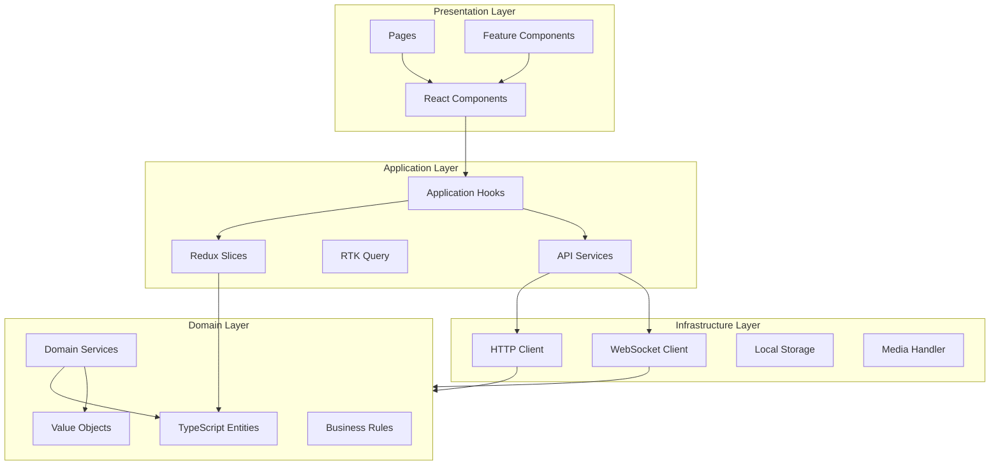
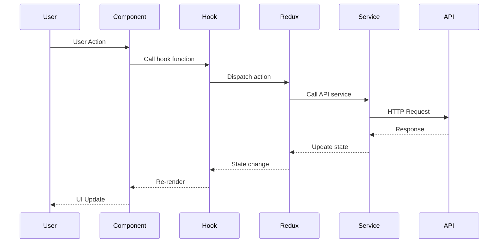
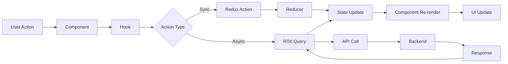
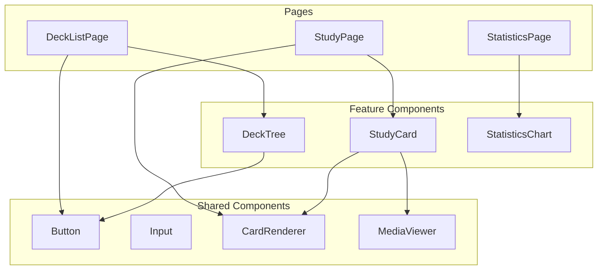
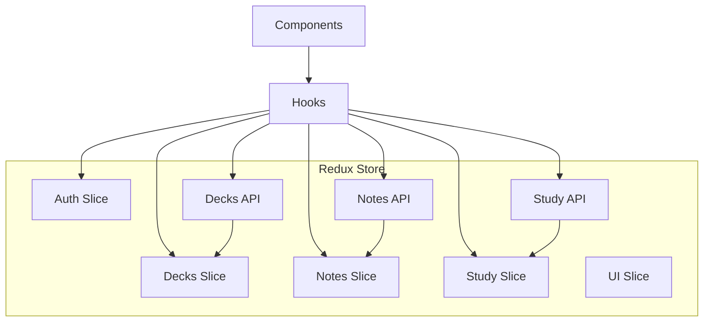

# Documentação Arquitetural do Frontend - Sistema Anki

Este documento descreve a arquitetura completa do frontend do sistema Anki, seguindo os princípios de **Clean Architecture adaptada para React**, **SOLID**, **Separation of Concerns** e **Feature-Based Development**.

## 1. Visão Geral da Arquitetura

### 1.1 Arquitetura Clean Adaptada para React

A arquitetura será organizada em camadas, adaptando os princípios de Clean Architecture para o ecossistema React/TypeScript:



### 1.2 Princípios Arquiteturais

- **Separation of Concerns**: Cada camada tem responsabilidade única e bem definida
- **Dependency Inversion**: Camadas externas dependem de abstrações (interfaces/types) definidas nas camadas internas
- **Single Responsibility**: Cada componente, hook e serviço tem uma única responsabilidade
- **Feature-Based Organization**: Código organizado por features (auth, decks, notes, study, etc.)
- **Unidirectional Data Flow**: Dados fluem em uma única direção (downward) através de props e estado
- **Component Composition**: Componentes complexos são construídos através da composição de componentes menores

### 1.3 Fluxo de Dados Unidirecional



## 2. Estrutura de Diretórios

```
frontend/
├── src/
│   ├── app/                    # Configuração da aplicação
│   │   ├── store/             # Redux store configuration
│   │   │   ├── index.ts       # Store setup
│   │   │   └── rootReducer.ts # Root reducer
│   │   ├── router/            # React Router setup
│   │   │   ├── index.tsx      # Router configuration
│   │   │   ├── routes.tsx     # Route definitions
│   │   │   └── ProtectedRoute.tsx
│   │   └── providers/         # Context providers
│   │       ├── ThemeProvider.tsx
│   │       └── I18nProvider.tsx
│   ├── features/              # Features (Feature-Based)
│   │   ├── auth/
│   │   │   ├── components/     # Feature-specific components
│   │   │   ├── hooks/         # Feature-specific hooks
│   │   │   ├── services/      # Feature-specific services
│   │   │   └── slice.ts       # Redux slice
│   │   ├── decks/
│   │   │   ├── components/
│   │   │   ├── hooks/
│   │   │   ├── services/
│   │   │   └── slice.ts
│   │   ├── notes/
│   │   │   ├── components/
│   │   │   ├── hooks/
│   │   │   ├── services/
│   │   │   └── slice.ts
│   │   ├── study/
│   │   │   ├── components/
│   │   │   ├── hooks/
│   │   │   ├── services/
│   │   │   └── slice.ts
│   │   ├── statistics/
│   │   │   ├── components/
│   │   │   ├── hooks/
│   │   │   └── services/
│   │   └── settings/
│   │       ├── components/
│   │       ├── hooks/
│   │       └── services/
│   │   ├── import/
│   │   │   ├── components/
│   │   │   ├── hooks/
│   │   │   └── services/
│   │   ├── export/
│   │   │   ├── components/
│   │   │   ├── hooks/
│   │   │   └── services/
│   │   ├── backups/
│   │   │   ├── components/
│   │   │   ├── hooks/
│   │   │   └── services/
│   │   ├── filtered-decks/
│   │   │   ├── components/
│   │   │   ├── hooks/
│   │   │   └── services/
│   │   └── shared-decks/
│   │       ├── components/
│   │       ├── hooks/
│   │       └── services/
│   ├── shared/                # Código compartilhado
│   │   ├── components/        # Componentes reutilizáveis
│   │   │   ├── ui/           # UI primitives (Button, Input, etc.)
│   │   │   ├── layout/       # Layout components
│   │   │   └── feedback/     # Loading, Error, etc.
│   │   ├── hooks/             # Custom hooks compartilhados
│   │   ├── utils/             # Utilitários
│   │   ├── types/             # TypeScript types compartilhados
│   │   └── constants/         # Constantes
│   ├── entities/              # Entidades de domínio (TypeScript)
│   │   ├── deck.ts
│   │   ├── note.ts
│   │   ├── card.ts
│   │   ├── user.ts
│   │   ├── review.ts
│   │   ├── noteType.ts
│   │   ├── filteredDeck.ts
│   │   ├── preset.ts
│   │   └── sharedDeck.ts
│   ├── services/              # Serviços de API
│   │   ├── api/
│   │   │   ├── auth.api.ts
│   │   │   ├── decks.api.ts
│   │   │   ├── notes.api.ts
│   │   │   └── study.api.ts
│   │   ├── websocket/
│   │   │   └── sync.websocket.ts
│   │   └── storage/
│   │       └── localStorage.ts
│   └── infrastructure/        # Adaptadores externos
│       ├── http/
│       │   ├── apiClient.ts
│       │   └── interceptors.ts
│       ├── websocket/
│       │   └── websocketClient.ts
│       └── storage/
│           └── storageAdapter.ts
├── public/                    # Assets estáticos
├── tests/                     # Testes
│   ├── unit/
│   ├── integration/
│   └── e2e/
└── docs/                      # Documentação
    └── architecture.md         # Este documento
```

## 3. Camadas Detalhadas

### 3.1 Presentation Layer (Componentes React)

**Responsabilidade**: Renderização da UI, interação com o usuário e apresentação de dados.

#### 3.1.1 Componentes de UI Reutilizáveis

Componentes básicos reutilizáveis que podem ser usados em qualquer lugar da aplicação.

**Exemplo: `src/shared/components/ui/Button.tsx`**

```typescript
import React from 'react';

export interface ButtonProps extends React.ButtonHTMLAttributes<HTMLButtonElement> {
  variant?: 'primary' | 'secondary' | 'danger';
  size?: 'sm' | 'md' | 'lg';
  isLoading?: boolean;
  children: React.ReactNode;
}

export const Button: React.FC<ButtonProps> = ({
  variant = 'primary',
  size = 'md',
  isLoading = false,
  children,
  disabled,
  className = '',
  ...props
}) => {
  const baseClasses = 'font-medium rounded-lg transition-colors';
  const variantClasses = {
    primary: 'bg-blue-600 text-white hover:bg-blue-700',
    secondary: 'bg-gray-200 text-gray-800 hover:bg-gray-300',
    danger: 'bg-red-600 text-white hover:bg-red-700',
  };
  const sizeClasses = {
    sm: 'px-3 py-1.5 text-sm',
    md: 'px-4 py-2 text-base',
    lg: 'px-6 py-3 text-lg',
  };

  return (
    <button
      className={`${baseClasses} ${variantClasses[variant]} ${sizeClasses[size]} ${className}`}
      disabled={disabled || isLoading}
      {...props}
    >
      {isLoading ? 'Loading...' : children}
    </button>
  );
};
```

#### 3.1.2 Páginas (Pages)

Páginas são componentes de nível superior que representam rotas completas.

**Exemplo: `src/features/decks/pages/DeckListPage.tsx`**

```typescript
import React from 'react';
import { useDeckList } from '../hooks/useDeckList';
import { DeckTree } from '../components/DeckTree';
import { LoadingSpinner } from '@/shared/components/ui/LoadingSpinner';
import { ErrorMessage } from '@/shared/components/ui/ErrorMessage';

export const DeckListPage: React.FC = () => {
  const { decks, isLoading, error, refetch } = useDeckList();

  if (isLoading) {
    return <LoadingSpinner />;
  }

  if (error) {
    return <ErrorMessage message={error.message} onRetry={refetch} />;
  }

  return (
    <div className="container mx-auto p-4">
      <h1 className="text-2xl font-bold mb-4">My Decks</h1>
      <DeckTree decks={decks} />
    </div>
  );
};
```

#### 3.1.3 Feature Components

Componentes específicos de uma feature que encapsulam lógica de negócio relacionada.

**Exemplo: `src/features/study/components/StudyCard.tsx`**

```typescript
import React, { useState } from 'react';
import { Card } from '@/entities/card';
import { CardRenderer } from '@/shared/components/CardRenderer';
import { StudyButtons } from './StudyButtons';
import { useStudySession } from '../hooks/useStudySession';

interface StudyCardProps {
  card: Card;
}

export const StudyCard: React.FC<StudyCardProps> = ({ card }) => {
  const [showAnswer, setShowAnswer] = useState(false);
  const { answerCard, isLoading } = useStudySession();

  const handleAnswer = async (rating: number) => {
    await answerCard(card.id, rating);
  };

  return (
    <div className="study-card">
      <CardRenderer
        card={card}
        showAnswer={showAnswer}
        onShowAnswer={() => setShowAnswer(true)}
      />
      {showAnswer && (
        <StudyButtons
          onAnswer={handleAnswer}
          isLoading={isLoading}
        />
      )}
    </div>
  );
};
```

### 3.2 Application Layer (Lógica de Aplicação)

**Responsabilidade**: Orquestra casos de uso, gerencia estado global e coordena chamadas de API.

#### 3.2.1 Redux Slices

Slices do Redux Toolkit organizam estado e ações relacionadas.

**Exemplo: `src/features/decks/slice.ts`**

```typescript
import { createSlice, createAsyncThunk, PayloadAction } from '@reduxjs/toolkit';
import { Deck } from '@/entities/deck';
import { decksApi } from '../services/decks.api';

interface DecksState {
  decks: Deck[];
  selectedDeckId: number | null;
  isLoading: boolean;
  error: string | null;
}

const initialState: DecksState = {
  decks: [],
  selectedDeckId: null,
  isLoading: false,
  error: null,
};

// Async thunk para buscar decks
export const fetchDecks = createAsyncThunk(
  'decks/fetchDecks',
  async (_, { rejectWithValue }) => {
    try {
      const decks = await decksApi.getDecks();
      return decks;
    } catch (error) {
      return rejectWithValue((error as Error).message);
    }
  }
);

// Async thunk para criar deck
export const createDeck = createAsyncThunk(
  'decks/createDeck',
  async (deckData: { name: string; parentId?: number }, { rejectWithValue }) => {
    try {
      const deck = await decksApi.createDeck(deckData);
      return deck;
    } catch (error) {
      return rejectWithValue((error as Error).message);
    }
  }
);

const decksSlice = createSlice({
  name: 'decks',
  initialState,
  reducers: {
    selectDeck: (state, action: PayloadAction<number>) => {
      state.selectedDeckId = action.payload;
    },
    clearError: (state) => {
      state.error = null;
    },
  },
  extraReducers: (builder) => {
    builder
      // fetchDecks
      .addCase(fetchDecks.pending, (state) => {
        state.isLoading = true;
        state.error = null;
      })
      .addCase(fetchDecks.fulfilled, (state, action) => {
        state.isLoading = false;
        state.decks = action.payload;
      })
      .addCase(fetchDecks.rejected, (state, action) => {
        state.isLoading = false;
        state.error = action.payload as string;
      })
      // createDeck
      .addCase(createDeck.fulfilled, (state, action) => {
        state.decks.push(action.payload);
      });
  },
});

export const { selectDeck, clearError } = decksSlice.actions;
export default decksSlice.reducer;
```

#### 3.2.2 RTK Query para Data Fetching

RTK Query simplifica data fetching e cache management.

**Exemplo: `src/features/decks/services/decks.api.ts`**

```typescript
import { createApi, fetchBaseQuery } from '@reduxjs/toolkit/query/react';
import { Deck } from '@/entities/deck';

export const decksApi = createApi({
  reducerPath: 'decksApi',
  baseQuery: fetchBaseQuery({
    baseUrl: '/api/v1/decks',
    prepareHeaders: (headers, { getState }) => {
      const token = (getState() as any).auth.token;
      if (token) {
        headers.set('authorization', `Bearer ${token}`);
      }
      return headers;
    },
  }),
  tagTypes: ['Deck'],
  endpoints: (builder) => ({
    getDecks: builder.query<Deck[], void>({
      query: () => '',
      providesTags: ['Deck'],
    }),
    getDeck: builder.query<Deck, number>({
      query: (id) => `/${id}`,
      providesTags: (result, error, id) => [{ type: 'Deck', id }],
    }),
    createDeck: builder.mutation<Deck, { name: string; parentId?: number }>({
      query: (body) => ({
        url: '',
        method: 'POST',
        body,
      }),
      invalidatesTags: ['Deck'],
    }),
    updateDeck: builder.mutation<Deck, { id: number; name: string }>({
      query: ({ id, ...body }) => ({
        url: `/${id}`,
        method: 'PUT',
        body,
      }),
      invalidatesTags: (result, error, { id }) => [{ type: 'Deck', id }],
    }),
    deleteDeck: builder.mutation<void, number>({
      query: (id) => ({
        url: `/${id}`,
        method: 'DELETE',
      }),
      invalidatesTags: ['Deck'],
    }),
  }),
});

export const {
  useGetDecksQuery,
  useGetDeckQuery,
  useCreateDeckMutation,
  useUpdateDeckMutation,
  useDeleteDeckMutation,
} = decksApi;
```

#### 3.2.3 Application Hooks

Hooks que encapsulam lógica de aplicação e coordenam múltiplos serviços.

**Exemplo: `src/features/decks/hooks/useDeckList.ts`**

```typescript
import { useGetDecksQuery } from '../services/decks.api';
import { useAppSelector } from '@/app/store';
import { selectDeck } from '../slice';

export const useDeckList = () => {
  const { data: decks = [], isLoading, error, refetch } = useGetDecksQuery();
  const selectedDeckId = useAppSelector((state) => state.decks.selectedDeckId);

  const selectedDeck = decks.find((deck) => deck.id === selectedDeckId);

  return {
    decks,
    selectedDeck,
    selectedDeckId,
    isLoading,
    error,
    refetch,
  };
};
```

### 3.3 Domain Layer (Lógica de Negócio)

**Responsabilidade**: Contém tipos TypeScript, entidades, value objects e funções puras de lógica de negócio.

#### 3.3.1 TypeScript Entities

**Exemplo: `src/entities/deck.ts`**

```typescript
export interface Deck {
  id: number;
  userId: number;
  name: string;
  parentId: number | null;
  options: DeckOptions;
  createdAt: string;
  updatedAt: string;
  deletedAt: string | null;
}

export interface DeckOptions {
  presetId: number | null;
  newCardsPerDay: number;
  maxReviewsPerDay: number;
  learningSteps: number[];
  graduatingInterval: number;
  easyInterval: number;
  relearningSteps: number[];
  minimumInterval: number;
  scheduler: 'sm2' | 'fsrs';
  fsrsEnabled: boolean;
  desiredRetention: number;
  intervalModifier: number;
  maximumInterval: number;
  easyBonus: number;
  hardInterval: number;
  newInterval: number;
  startingEase: number;
  buryNewSiblings: boolean;
  buryReviewSiblings: boolean;
  buryInterdayLearningSiblings: boolean;
  leechThreshold: number;
  leechAction: string;
}

// Domain methods
export const Deck = {
  isRoot: (deck: Deck): boolean => deck.parentId === null,
  
  getFullPath: (deck: Deck, allDecks: Deck[]): string => {
    const path: string[] = [deck.name];
    let current = deck;
    
    while (current.parentId) {
      const parent = allDecks.find((d) => d.id === current.parentId);
      if (!parent) break;
      path.unshift(parent.name);
      current = parent;
    }
    
    return path.join('::');
  },
  
  getChildren: (deck: Deck, allDecks: Deck[]): Deck[] => {
    return allDecks.filter((d) => d.parentId === deck.id);
  },
};
```

**Exemplo: `src/entities/card.ts`**

```typescript
export type CardState = 'new' | 'learn' | 'review' | 'relearn';

export interface Card {
  id: number;
  noteId: number;
  cardTypeId: number;
  deckId: number;
  homeDeckId: number | null;
  due: number; // Timestamp em ms
  interval: number; // Dias
  ease: number; // Permille (2500 = 2.5x)
  lapses: number;
  reps: number;
  state: CardState;
  position: number;
  flag: number; // 0-7
  suspended: boolean;
  buried: boolean;
  stability: number | null; // FSRS
  difficulty: number | null; // FSRS
  lastReviewAt: string | null;
  createdAt: string;
  updatedAt: string;
}

// Domain methods
export const Card = {
  isDue: (card: Card, now: number): boolean => {
    if (card.suspended || card.buried) return false;
    
    switch (card.state) {
      case 'new':
        return true;
      case 'learn':
      case 'relearn':
      case 'review':
        return card.due <= now;
      default:
        return false;
    }
  },
  
  getNextReviewTime: (card: Card): number => {
    return card.due;
  },
};
```

**Exemplo: `src/entities/noteType.ts`**

```typescript
export interface CardType {
  id: number;
  name: string;
  frontTemplate: string;
  backTemplate: string;
}

export interface NoteType {
  id: number;
  userId: number;
  name: string;
  fields: string[];
  cardTypes: CardType[];
  css: string;
  createdAt: string;
  updatedAt: string;
}

// Domain methods
export const NoteType = {
  getFieldCount: (noteType: NoteType): number => {
    return noteType.fields.length;
  },
  
  getCardTypeCount: (noteType: NoteType): number => {
    return noteType.cardTypes.length;
  },
};
```

**Exemplo: `src/entities/filteredDeck.ts`**

```typescript
export interface FilteredDeck {
  id: number;
  userId: number;
  name: string;
  searchQuery: string;
  deckId: number | null;
  order: 'random' | 'due' | 'interval' | 'added';
  reschedule: boolean;
  rescheduleDays: number;
  maxCards: number;
  createdAt: string;
  updatedAt: string;
}

// Domain methods
export const FilteredDeck = {
  isValid: (deck: FilteredDeck): boolean => {
    return deck.searchQuery.trim().length > 0;
  },
};
```

**Exemplo: `src/entities/preset.ts`**

```typescript
export interface Preset {
  id: number;
  userId: number;
  name: string;
  options: DeckOptions;
  createdAt: string;
  updatedAt: string;
}
```

**Exemplo: `src/entities/sharedDeck.ts`**

```typescript
export interface SharedDeck {
  id: number;
  deckId: number;
  userId: number;
  publicId: string;
  title: string;
  description: string;
  tags: string[];
  downloadCount: number;
  rating: number;
  isPublic: boolean;
  createdAt: string;
  updatedAt: string;
}
```

#### 3.3.2 Value Objects

**Exemplo: `src/entities/valueObjects.ts`**

```typescript
// Email value object
export class Email {
  private constructor(private readonly value: string) {
    if (!this.isValid(value)) {
      throw new Error('Invalid email address');
    }
  }

  static create(value: string): Email {
    return new Email(value.toLowerCase().trim());
  }

  private isValid(email: string): boolean {
    const emailRegex = /^[^\s@]+@[^\s@]+\.[^\s@]+$/;
    return emailRegex.test(email);
  }

  toString(): string {
    return this.value;
  }

  equals(other: Email): boolean {
    return this.value === other.value;
  }
}

// CardState value object
export type CardStateType = 'new' | 'learn' | 'review' | 'relearn';

export const CardState = {
  NEW: 'new' as CardStateType,
  LEARN: 'learn' as CardStateType,
  REVIEW: 'review' as CardStateType,
  RELEARN: 'relearn' as CardStateType,

  isValid: (state: string): state is CardStateType => {
    return ['new', 'learn', 'review', 'relearn'].includes(state);
  },
};
```

#### 3.3.3 Domain Services (Funções Puras)

**Exemplo: `src/entities/services/templateRenderer.ts`**

```typescript
import { Note } from '../note';
import { NoteType } from '../noteType';

export interface RenderContext {
  note: Note;
  noteType: NoteType;
  cardTypeId: number;
  side: 'front' | 'back';
}

export const TemplateRenderer = {
  render: (context: RenderContext): string => {
    const { note, noteType, cardTypeId, side } = context;
    const cardType = noteType.cardTypes[cardTypeId];
    const template = side === 'front' 
      ? cardType.frontTemplate 
      : cardType.backTemplate;
    
    let rendered = template;
    
    // Replace field placeholders: {{FieldName}}
    for (const [fieldName, fieldValue] of Object.entries(note.fields)) {
      const regex = new RegExp(`\\{\\{${fieldName}\\}\\}`, 'g');
      rendered = rendered.replace(regex, fieldValue || '');
    }
    
    // Replace special fields
    rendered = rendered.replace(/\{\{FrontSide\}\}/g, 
      TemplateRenderer.render({ ...context, side: 'front' }));
    rendered = rendered.replace(/\{\{Tags\}\}/g, note.tags.join(' '));
    rendered = rendered.replace(/\{\{Deck\}\}/g, note.deckName || '');
    
    // Process conditional replacements: {{#Field}}...{{/Field}}
    rendered = TemplateRenderer.processConditionals(rendered, note.fields);
    
    return rendered;
  },
  
  processConditionals: (template: string, fields: Record<string, string>): string => {
    // Process {{#Field}}...{{/Field}} (if field is not empty)
    let result = template;
    const conditionalRegex = /\{\{#(\w+)\}\}(.*?)\{\{\/\1\}\}/gs;
    
    result = result.replace(conditionalRegex, (match, fieldName, content) => {
      return fields[fieldName] ? content : '';
    });
    
    // Process {{^Field}}...{{/Field}} (if field is empty)
    const negativeConditionalRegex = /\{\{\^(\w+)\}\}(.*?)\{\{\/\1\}\}/gs;
    result = result.replace(negativeConditionalRegex, (match, fieldName, content) => {
      return !fields[fieldName] ? content : '';
    });
    
    return result;
  },
};
```

**Exemplo: `src/entities/services/searchParser.ts`**

```typescript
export interface SearchTerm {
  field: string;
  operator: string;
  value: string;
}

export interface ParsedQuery {
  terms: SearchTerm[];
  operators: ('AND' | 'OR' | 'NOT')[];
}

export const SearchParser = {
  parse: (query: string): ParsedQuery => {
    const terms: SearchTerm[] = [];
    const operators: ('AND' | 'OR' | 'NOT')[] = [];
    
    // Simple field search: deck:Math
    const fieldRegex = /(\w+):([^\s]+)/g;
    let match;
    
    while ((match = fieldRegex.exec(query)) !== null) {
      terms.push({
        field: match[1],
        operator: ':',
        value: match[2],
      });
    }
    
    // State search: is:due, is:new
    const stateRegex = /is:(\w+)/g;
    while ((match = stateRegex.exec(query)) !== null) {
      terms.push({
        field: 'state',
        operator: '=',
        value: match[1],
      });
    }
    
    // Tag search: tag:important
    const tagRegex = /tag:([^\s]+)/g;
    while ((match = tagRegex.exec(query)) !== null) {
      terms.push({
        field: 'tag',
        operator: '=',
        value: match[1],
      });
    }
    
    return { terms, operators };
  },
};
```

### 3.4 Infrastructure Layer (Adaptadores)

**Responsabilidade**: Implementa adaptadores para tecnologias externas (HTTP, WebSocket, LocalStorage).

#### 3.4.1 HTTP Client

**Exemplo: `src/infrastructure/http/apiClient.ts`**

```typescript
import axios, { AxiosInstance, AxiosRequestConfig, AxiosResponse } from 'axios';

class ApiClient {
  private client: AxiosInstance;

  constructor(baseURL: string) {
    this.client = axios.create({
      baseURL,
      timeout: 30000,
      headers: {
        'Content-Type': 'application/json',
      },
    });

    this.setupInterceptors();
  }

  private setupInterceptors(): void {
    // Request interceptor
    this.client.interceptors.request.use(
      (config) => {
        const token = this.getToken();
        if (token) {
          config.headers.Authorization = `Bearer ${token}`;
        }
        return config;
      },
      (error) => Promise.reject(error)
    );

    // Response interceptor
    this.client.interceptors.response.use(
      (response) => response,
      async (error) => {
        if (error.response?.status === 401) {
          // Handle unauthorized - redirect to login
          window.location.href = '/login';
        }
        return Promise.reject(error);
      }
    );
  }

  private getToken(): string | null {
    return localStorage.getItem('auth_token');
  }

  async get<T>(url: string, config?: AxiosRequestConfig): Promise<T> {
    const response: AxiosResponse<T> = await this.client.get(url, config);
    return response.data;
  }

  async post<T>(url: string, data?: any, config?: AxiosRequestConfig): Promise<T> {
    const response: AxiosResponse<T> = await this.client.post(url, data, config);
    return response.data;
  }

  async put<T>(url: string, data?: any, config?: AxiosRequestConfig): Promise<T> {
    const response: AxiosResponse<T> = await this.client.put(url, data, config);
    return response.data;
  }

  async delete<T>(url: string, config?: AxiosRequestConfig): Promise<T> {
    const response: AxiosResponse<T> = await this.client.delete(url, config);
    return response.data;
  }
}

export const apiClient = new ApiClient(import.meta.env.VITE_API_BASE_URL || '/api/v1');
```

#### 3.4.2 WebSocket Client

**Exemplo: `src/infrastructure/websocket/websocketClient.ts`**

```typescript
type MessageHandler = (data: any) => void;

class WebSocketClient {
  private ws: WebSocket | null = null;
  private handlers: Map<string, MessageHandler[]> = new Map();
  private reconnectAttempts = 0;
  private maxReconnectAttempts = 5;

  connect(url: string): void {
    if (this.ws?.readyState === WebSocket.OPEN) {
      return;
    }

    this.ws = new WebSocket(url);

    this.ws.onopen = () => {
      console.log('WebSocket connected');
      this.reconnectAttempts = 0;
    };

    this.ws.onmessage = (event) => {
      try {
        const message = JSON.parse(event.data);
        this.handleMessage(message);
      } catch (error) {
        console.error('Failed to parse WebSocket message:', error);
      }
    };

    this.ws.onerror = (error) => {
      console.error('WebSocket error:', error);
    };

    this.ws.onclose = () => {
      console.log('WebSocket disconnected');
      this.attemptReconnect(url);
    };
  }

  private attemptReconnect(url: string): void {
    if (this.reconnectAttempts < this.maxReconnectAttempts) {
      this.reconnectAttempts++;
      const delay = Math.min(1000 * Math.pow(2, this.reconnectAttempts), 30000);
      setTimeout(() => this.connect(url), delay);
    }
  }

  private handleMessage(message: { type: string; data: any }): void {
    const handlers = this.handlers.get(message.type) || [];
    handlers.forEach((handler) => handler(message.data));
  }

  on(messageType: string, handler: MessageHandler): void {
    if (!this.handlers.has(messageType)) {
      this.handlers.set(messageType, []);
    }
    this.handlers.get(messageType)!.push(handler);
  }

  off(messageType: string, handler: MessageHandler): void {
    const handlers = this.handlers.get(messageType);
    if (handlers) {
      const index = handlers.indexOf(handler);
      if (index > -1) {
        handlers.splice(index, 1);
      }
    }
  }

  send(type: string, data: any): void {
    if (this.ws?.readyState === WebSocket.OPEN) {
      this.ws.send(JSON.stringify({ type, data }));
    }
  }

  disconnect(): void {
    if (this.ws) {
      this.ws.close();
      this.ws = null;
    }
  }
}

export const websocketClient = new WebSocketClient();
```

#### 3.4.3 Local Storage Adapter

**Exemplo: `src/infrastructure/storage/storageAdapter.ts`**

```typescript
interface StorageAdapter {
  get<T>(key: string): T | null;
  set<T>(key: string, value: T): void;
  remove(key: string): void;
  clear(): void;
}

class LocalStorageAdapter implements StorageAdapter {
  get<T>(key: string): T | null {
    try {
      const item = localStorage.getItem(key);
      return item ? JSON.parse(item) : null;
    } catch (error) {
      console.error(`Error reading from localStorage key "${key}":`, error);
      return null;
    }
  }

  set<T>(key: string, value: T): void {
    try {
      localStorage.setItem(key, JSON.stringify(value));
    } catch (error) {
      console.error(`Error writing to localStorage key "${key}":`, error);
    }
  }

  remove(key: string): void {
    try {
      localStorage.removeItem(key);
    } catch (error) {
      console.error(`Error removing from localStorage key "${key}":`, error);
    }
  }

  clear(): void {
    try {
      localStorage.clear();
    } catch (error) {
      console.error('Error clearing localStorage:', error);
    }
  }
}

export const storageAdapter: StorageAdapter = new LocalStorageAdapter();
```

## 4. Gerenciamento de Estado (Redux Toolkit)

### 4.1 Store Structure

**Exemplo: `src/app/store/index.ts`**

```typescript
import { configureStore } from '@reduxjs/toolkit';
import { setupListeners } from '@reduxjs/toolkit/query';
import { persistStore, persistReducer } from 'redux-persist';
import storage from 'redux-persist/lib/storage';
import { combineReducers } from '@reduxjs/toolkit';

import authReducer from '@/features/auth/slice';
import decksReducer from '@/features/decks/slice';
import notesReducer from '@/features/notes/slice';
import studyReducer from '@/features/study/slice';
import uiReducer from '@/shared/slices/ui';
import { decksApi } from '@/features/decks/services/decks.api';
import { notesApi } from '@/features/notes/services/notes.api';
import { studyApi } from '@/features/study/services/study.api';

const persistConfig = {
  key: 'root',
  storage,
  whitelist: ['auth'], // Apenas auth será persistido
};

const rootReducer = combineReducers({
  auth: authReducer,
  decks: decksReducer,
  notes: notesReducer,
  study: studyReducer,
  ui: uiReducer,
  [decksApi.reducerPath]: decksApi.reducer,
  [notesApi.reducerPath]: notesApi.reducer,
  [studyApi.reducerPath]: studyApi.reducer,
});

const persistedReducer = persistReducer(persistConfig, rootReducer);

export const store = configureStore({
  reducer: persistedReducer,
  middleware: (getDefaultMiddleware) =>
    getDefaultMiddleware({
      serializableCheck: {
        ignoredActions: ['persist/PERSIST', 'persist/REHYDRATE'],
      },
    })
      .concat(decksApi.middleware)
      .concat(notesApi.middleware)
      .concat(studyApi.middleware),
  devTools: process.env.NODE_ENV !== 'production',
});

setupListeners(store.dispatch);

export const persistor = persistStore(store);

export type RootState = ReturnType<typeof store.getState>;
export type AppDispatch = typeof store.dispatch;

// Typed hooks
export const useAppDispatch = () => useDispatch<AppDispatch>();
export const useAppSelector: TypedUseSelectorHook<RootState> = useSelector;
```

### 4.2 Slices Principais

#### 4.2.1 Auth Slice

**Exemplo: `src/features/auth/slice.ts`**

```typescript
import { createSlice, createAsyncThunk, PayloadAction } from '@reduxjs/toolkit';
import { authApi } from '../services/auth.api';
import { User } from '@/entities/user';

interface AuthState {
  user: User | null;
  token: string | null;
  isAuthenticated: boolean;
  isLoading: boolean;
  error: string | null;
}

const initialState: AuthState = {
  user: null,
  token: null,
  isAuthenticated: false,
  isLoading: false,
  error: null,
};

export const login = createAsyncThunk(
  'auth/login',
  async (credentials: { email: string; password: string }, { rejectWithValue }) => {
    try {
      const response = await authApi.login(credentials);
      return response;
    } catch (error) {
      return rejectWithValue((error as Error).message);
    }
  }
);

export const logout = createAsyncThunk('auth/logout', async () => {
  await authApi.logout();
});

const authSlice = createSlice({
  name: 'auth',
  initialState,
  reducers: {
    clearError: (state) => {
      state.error = null;
    },
  },
  extraReducers: (builder) => {
    builder
      .addCase(login.pending, (state) => {
        state.isLoading = true;
        state.error = null;
      })
      .addCase(login.fulfilled, (state, action) => {
        state.isLoading = false;
        state.user = action.payload.user;
        state.token = action.payload.token;
        state.isAuthenticated = true;
      })
      .addCase(login.rejected, (state, action) => {
        state.isLoading = false;
        state.error = action.payload as string;
      })
      .addCase(logout.fulfilled, (state) => {
        state.user = null;
        state.token = null;
        state.isAuthenticated = false;
      });
  },
});

export const { clearError } = authSlice.actions;
export default authSlice.reducer;
```

#### 4.2.2 Study Slice

**Exemplo: `src/features/study/slice.ts`**

```typescript
import { createSlice, createAsyncThunk, PayloadAction } from '@reduxjs/toolkit';
import { Card } from '@/entities/card';
import { studyApi } from '../services/study.api';

interface StudyState {
  currentCard: Card | null;
  cardsQueue: Card[];
  sessionStats: {
    new: number;
    learn: number;
    review: number;
    relearn: number;
  };
  isAnswering: boolean;
}

const initialState: StudyState = {
  currentCard: null,
  cardsQueue: [],
  sessionStats: {
    new: 0,
    learn: 0,
    review: 0,
    relearn: 0,
  },
  isAnswering: false,
};

export const answerCard = createAsyncThunk(
  'study/answerCard',
  async (
    { cardId, rating }: { cardId: number; rating: number },
    { rejectWithValue }
  ) => {
    try {
      const updatedCard = await studyApi.answerCard(cardId, rating);
      return { updatedCard, rating };
    } catch (error) {
      return rejectWithValue((error as Error).message);
    }
  }
);

const studySlice = createSlice({
  name: 'study',
  initialState,
  reducers: {
    setCurrentCard: (state, action: PayloadAction<Card | null>) => {
      state.currentCard = action.payload;
    },
    setCardsQueue: (state, action: PayloadAction<Card[]>) => {
      state.cardsQueue = action.payload;
    },
    nextCard: (state) => {
      state.cardsQueue.shift();
      state.currentCard = state.cardsQueue[0] || null;
    },
    resetSession: (state) => {
      state.currentCard = null;
      state.cardsQueue = [];
      state.sessionStats = { new: 0, learn: 0, review: 0, relearn: 0 };
    },
  },
  extraReducers: (builder) => {
    builder
      .addCase(answerCard.pending, (state) => {
        state.isAnswering = true;
      })
      .addCase(answerCard.fulfilled, (state, action) => {
        state.isAnswering = false;
        const { rating } = action.payload;
        
        // Update stats
        if (state.currentCard) {
          switch (state.currentCard.state) {
            case 'new':
              state.sessionStats.new++;
              break;
            case 'learn':
              state.sessionStats.learn++;
              break;
            case 'review':
              state.sessionStats.review++;
              break;
            case 'relearn':
              state.sessionStats.relearn++;
              break;
          }
        }
        
        // Move to next card
        studySlice.caseReducers.nextCard(state);
      })
      .addCase(answerCard.rejected, (state) => {
        state.isAnswering = false;
      });
  },
});

export const { setCurrentCard, setCardsQueue, nextCard, resetSession } =
  studySlice.actions;
export default studySlice.reducer;
```

### 4.3 RTK Query Middleware

RTK Query automaticamente gerencia cache, invalidação e sincronização de dados.

**Exemplo de uso em componente:**

```typescript
import { useGetDecksQuery, useCreateDeckMutation } from '@/features/decks/services/decks.api';

const DeckList = () => {
  const { data: decks, isLoading, error } = useGetDecksQuery();
  const [createDeck, { isLoading: isCreating }] = useCreateDeckMutation();

  const handleCreate = async () => {
    try {
      await createDeck({ name: 'New Deck' }).unwrap();
      // Cache será automaticamente invalidado e dados refetchados
    } catch (error) {
      console.error('Failed to create deck:', error);
    }
  };

  // ...
};
```

## 5. Roteamento (React Router)

### 5.1 Estrutura de Rotas

**Exemplo: `src/app/router/routes.tsx`**

```typescript
import { lazy } from 'react';
import { RouteObject } from 'react-router-dom';
import { ProtectedRoute } from './ProtectedRoute';

// Lazy loading de páginas
const LoginPage = lazy(() => import('@/features/auth/pages/LoginPage'));
const RegisterPage = lazy(() => import('@/features/auth/pages/RegisterPage'));
const DeckListPage = lazy(() => import('@/features/decks/pages/DeckListPage'));
const DeckDetailPage = lazy(() => import('@/features/decks/pages/DeckDetailPage'));
const StudyPage = lazy(() => import('@/features/study/pages/StudyPage'));
const StatisticsPage = lazy(() => import('@/features/statistics/pages/StatisticsPage'));
const SettingsPage = lazy(() => import('@/features/settings/pages/SettingsPage'));
const BrowsePage = lazy(() => import('@/features/notes/pages/BrowsePage'));
const NoteEditorPage = lazy(() => import('@/features/notes/pages/NoteEditorPage'));
const ImportPage = lazy(() => import('@/features/import/pages/ImportPage'));
const ExportPage = lazy(() => import('@/features/export/pages/ExportPage'));

export const routes: RouteObject[] = [
  {
    path: '/login',
    element: <LoginPage />,
  },
  {
    path: '/register',
    element: <RegisterPage />,
  },
  {
    path: '/',
    element: <ProtectedRoute />,
    children: [
      {
        index: true,
        element: <DeckListPage />,
      },
      {
        path: 'decks/:id',
        element: <DeckDetailPage />,
      },
      {
        path: 'study',
        element: <StudyPage />,
      },
      {
        path: 'statistics',
        element: <StatisticsPage />,
      },
      {
        path: 'settings',
        element: <SettingsPage />,
      },
      {
        path: 'browse',
        element: <BrowsePage />,
      },
      {
        path: 'notes/new',
        element: <NoteEditorPage />,
      },
      {
        path: 'notes/:id/edit',
        element: <NoteEditorPage />,
      },
      {
        path: 'import',
        element: <ImportPage />,
      },
      {
        path: 'export',
        element: <ExportPage />,
      },
    ],
  },
];
```

### 5.2 Protected Routes

**Exemplo: `src/app/router/ProtectedRoute.tsx`**

```typescript
import React from 'react';
import { Navigate, Outlet } from 'react-router-dom';
import { useAppSelector } from '@/app/store';

export const ProtectedRoute: React.FC = () => {
  const isAuthenticated = useAppSelector((state) => state.auth.isAuthenticated);

  if (!isAuthenticated) {
    return <Navigate to="/login" replace />;
  }

  return <Outlet />;
};
```

### 5.3 Router Configuration

**Exemplo: `src/app/router/index.tsx`**

```typescript
import React, { Suspense } from 'react';
import { createBrowserRouter, RouterProvider } from 'react-router-dom';
import { routes } from './routes';
import { LoadingSpinner } from '@/shared/components/ui/LoadingSpinner';

const router = createBrowserRouter(routes);

export const AppRouter: React.FC = () => {
  return (
    <Suspense fallback={<LoadingSpinner />}>
      <RouterProvider router={router} />
    </Suspense>
  );
};
```

## 6. Componentes Principais

### 6.1 CardRenderer

Componente responsável por renderizar cards com suporte a templates, TTS, Ruby characters e RTL.

**Exemplo: `src/shared/components/CardRenderer.tsx`**

```typescript
import React, { useEffect, useRef } from 'react';
import { Card } from '@/entities/card';
import { Note } from '@/entities/note';
import { TemplateRenderer } from '@/entities/services/templateRenderer';
import { MediaViewer } from './MediaViewer';

interface CardRendererProps {
  card: Card;
  note: Note;
  showAnswer: boolean;
  onShowAnswer?: () => void;
}

export const CardRenderer: React.FC<CardRendererProps> = ({
  card,
  note,
  showAnswer,
  onShowAnswer,
}) => {
  const frontRef = useRef<HTMLDivElement>(null);
  const backRef = useRef<HTMLDivElement>(null);

  const frontHtml = TemplateRenderer.render({
    note,
    noteType: note.noteType,
    cardTypeId: card.cardTypeId,
    side: 'front',
  });

  const backHtml = showAnswer
    ? TemplateRenderer.render({
        note,
        noteType: note.noteType,
        cardTypeId: card.cardTypeId,
        side: 'back',
      })
    : null;

  // Processar Ruby characters (furigana)
  const processRuby = (html: string): string => {
    // Converter [kanji:reading] para <ruby>kanji<rt>reading</rt></ruby>
    return html.replace(
      /\[([^\]]+):([^\]]+)\]/g,
      '<ruby>$1<rt>$2</rt></ruby>'
    );
  };

  // Detectar direção RTL
  const isRTL = (text: string): boolean => {
    const rtlChars = /[\u0590-\u05FF\u0600-\u06FF\u0700-\u074F\u0750-\u077F\u08A0-\u08FF\uFB50-\uFDFF\uFE70-\uFEFF]/;
    return rtlChars.test(text);
  };

  useEffect(() => {
    if (frontRef.current) {
      const processedHtml = processRuby(frontHtml);
      frontRef.current.innerHTML = processedHtml;
      
      // Aplicar direção RTL se necessário
      if (isRTL(processedHtml)) {
        frontRef.current.dir = 'rtl';
      }
    }
  }, [frontHtml]);

  useEffect(() => {
    if (backRef.current && backHtml) {
      const processedHtml = processRuby(backHtml);
      backRef.current.innerHTML = processedHtml;
      
      if (isRTL(processedHtml)) {
        backRef.current.dir = 'rtl';
      }
    }
  }, [backHtml]);

  return (
    <div className="card-renderer">
      <div
        ref={frontRef}
        className="card-front"
        onClick={!showAnswer && onShowAnswer ? onShowAnswer : undefined}
      />
      {showAnswer && backHtml && (
        <div ref={backRef} className="card-back" />
      )}
      <MediaViewer note={note} />
    </div>
  );
};
```

### 6.1.1 TTS (Text-to-Speech) Support

**Exemplo: `src/shared/components/TTSRenderer.tsx`**

```typescript
import React, { useEffect, useRef } from 'react';

interface TTSRendererProps {
  text: string;
  lang?: string;
  voice?: string;
  speed?: number;
  autoPlay?: boolean;
}

export const TTSRenderer: React.FC<TTSRendererProps> = ({
  text,
  lang = 'en-US',
  voice,
  speed = 1,
  autoPlay = false,
}) => {
  const utteranceRef = useRef<SpeechSynthesisUtterance | null>(null);

  useEffect(() => {
    if (!text || typeof window === 'undefined' || !window.speechSynthesis) {
      return;
    }

    const utterance = new SpeechSynthesisUtterance(text);
    utterance.lang = lang;
    utterance.rate = speed;

    if (voice) {
      const voices = window.speechSynthesis.getVoices();
      const selectedVoice = voices.find((v) => v.name === voice);
      if (selectedVoice) {
        utterance.voice = selectedVoice;
      }
    }

    utteranceRef.current = utterance;

    if (autoPlay) {
      window.speechSynthesis.speak(utterance);
    }

    return () => {
      if (utteranceRef.current) {
        window.speechSynthesis.cancel();
      }
    };
  }, [text, lang, voice, speed, autoPlay]);

  const speak = () => {
    if (utteranceRef.current) {
      window.speechSynthesis.speak(utteranceRef.current);
    }
  };

  const stop = () => {
    window.speechSynthesis.cancel();
  };

  return (
    <div className="tts-renderer">
      <button onClick={speak}>🔊 Play</button>
      <button onClick={stop}>⏹ Stop</button>
    </div>
  );
};
```

**Processamento de TTS no TemplateRenderer:**

```typescript
// Adicionar ao TemplateRenderer
processTTS: (html: string): string => {
  // Processar {{tts lang:Field}}
  const ttsRegex = /\{\{tts\s+([^:}]+):([^}]+)\}\}/g;
  html = html.replace(ttsRegex, (match, lang, field) => {
    return `<span class="tts-field" data-lang="${lang}" data-field="${field}"></span>`;
  });
  
  // Processar [anki:tts]...[/anki:tts]
  const ttsBlockRegex = /\[anki:tts\](.*?)\[\/anki:tts\]/gs;
  html = html.replace(ttsBlockRegex, (match, content) => {
    return `<span class="tts-block">${content}</span>`;
  });
  
  return html;
},
```

### 6.2 MediaViewer

Componente para exibir mídia (imagens, áudio, vídeo, LaTeX, MathJax).

**Exemplo: `src/shared/components/MediaViewer.tsx`**

```typescript
import React, { useEffect } from 'react';
import { Note } from '@/entities/note';
import katex from 'katex';
import 'katex/dist/katex.min.css';

interface MediaViewerProps {
  note: Note;
}

export const MediaViewer: React.FC<MediaViewerProps> = ({ note }) => {
  const mediaContainerRef = React.useRef<HTMLDivElement>(null);

  useEffect(() => {
    if (!mediaContainerRef.current) return;

    // Processar LaTeX/MathJax
    const mathElements = mediaContainerRef.current.querySelectorAll('.latex, .math');
    mathElements.forEach((element) => {
      const text = element.textContent || '';
      try {
        katex.render(text, element as HTMLElement, {
          throwOnError: false,
        });
      } catch (error) {
        console.error('KaTeX rendering error:', error);
      }
    });

    // Processar imagens
    const images = mediaContainerRef.current.querySelectorAll('img');
    images.forEach((img) => {
      const src = img.getAttribute('src');
      if (src && !src.startsWith('http')) {
        // Assumir que mídia está em /media/
        img.src = `/media/${src}`;
      }
    });

    // Processar áudio
    const audioElements = mediaContainerRef.current.querySelectorAll('audio');
    audioElements.forEach((audio) => {
      const src = audio.getAttribute('src');
      if (src && !src.startsWith('http')) {
        audio.src = `/media/${src}`;
      }
    });
  }, [note]);

  return (
    <div ref={mediaContainerRef} className="media-viewer">
      {/* Mídia será renderizada através do innerHTML processado */}
    </div>
  );
};
```

### 6.3 SearchBar

Componente de busca com suporte à sintaxe Anki.

**Exemplo: `src/shared/components/SearchBar.tsx`**

```typescript
import React, { useState } from 'react';
import { SearchParser } from '@/entities/services/searchParser';

interface SearchBarProps {
  onSearch: (query: string) => void;
  placeholder?: string;
}

export const SearchBar: React.FC<SearchBarProps> = ({
  onSearch,
  placeholder = 'Search...',
}) => {
  const [query, setQuery] = useState('');

  const handleSubmit = (e: React.FormEvent) => {
    e.preventDefault();
    if (query.trim()) {
      onSearch(query.trim());
    }
  };

  const handleChange = (e: React.ChangeEvent<HTMLInputElement>) => {
    setQuery(e.target.value);
  };

  return (
    <form onSubmit={handleSubmit} className="search-bar">
      <input
        type="text"
        value={query}
        onChange={handleChange}
        placeholder={placeholder}
        className="search-input"
      />
      <button type="submit" className="search-button">
        Search
      </button>
    </form>
  );
};
```

### 6.4 DeckTree

Componente para exibir árvore hierárquica de decks.

**Exemplo: `src/features/decks/components/DeckTree.tsx`**

```typescript
import React, { useState } from 'react';
import { Deck } from '@/entities/deck';

interface DeckTreeProps {
  decks: Deck[];
  onSelectDeck?: (deckId: number) => void;
  selectedDeckId?: number;
}

export const DeckTree: React.FC<DeckTreeProps> = ({
  decks,
  onSelectDeck,
  selectedDeckId,
}) => {
  const [expandedDecks, setExpandedDecks] = useState<Set<number>>(new Set());

  const toggleExpand = (deckId: number) => {
    setExpandedDecks((prev) => {
      const next = new Set(prev);
      if (next.has(deckId)) {
        next.delete(deckId);
      } else {
        next.add(deckId);
      }
      return next;
    });
  };

  const getRootDecks = () => decks.filter((deck) => deck.parentId === null);

  const getChildren = (parentId: number) =>
    decks.filter((deck) => deck.parentId === parentId);

  const renderDeck = (deck: Deck, level: number = 0) => {
    const children = getChildren(deck.id);
    const hasChildren = children.length > 0;
    const isExpanded = expandedDecks.has(deck.id);
    const isSelected = selectedDeckId === deck.id;

    return (
      <div key={deck.id} className="deck-tree-item">
        <div
          className={`deck-tree-row ${isSelected ? 'selected' : ''}`}
          style={{ paddingLeft: `${level * 20}px` }}
          onClick={() => onSelectDeck?.(deck.id)}
        >
          {hasChildren && (
            <button
              onClick={(e) => {
                e.stopPropagation();
                toggleExpand(deck.id);
              }}
              className="expand-button"
            >
              {isExpanded ? '▼' : '▶'}
            </button>
          )}
          <span className="deck-name">{deck.name}</span>
          <span className="deck-counts">
            ({deck.newCount || 0} new, {deck.learnCount || 0} learn,{' '}
            {deck.reviewCount || 0} review)
          </span>
        </div>
        {hasChildren && isExpanded && (
          <div className="deck-tree-children">
            {children.map((child) => renderDeck(child, level + 1))}
          </div>
        )}
      </div>
    );
  };

  return (
    <div className="deck-tree">
      {getRootDecks().map((deck) => renderDeck(deck))}
    </div>
  );
};
```

### 6.5 StatisticsChart

Componente para exibir gráficos de estatísticas.

**Exemplo: `src/shared/components/StatisticsChart.tsx`**

```typescript
import React from 'react';
import {
  LineChart,
  Line,
  BarChart,
  Bar,
  XAxis,
  YAxis,
  CartesianGrid,
  Tooltip,
  Legend,
  ResponsiveContainer,
} from 'recharts';

interface StatisticsChartProps {
  data: Array<{ date: string; [key: string]: any }>;
  type: 'line' | 'bar';
  dataKeys: string[];
}

export const StatisticsChart: React.FC<StatisticsChartProps> = ({
  data,
  type,
  dataKeys,
}) => {
  const ChartComponent = type === 'line' ? LineChart : BarChart;
  const DataComponent = type === 'line' ? Line : Bar;

  return (
    <ResponsiveContainer width="100%" height={400}>
      <ChartComponent data={data}>
        <CartesianGrid strokeDasharray="3 3" />
        <XAxis dataKey="date" />
        <YAxis />
        <Tooltip />
        <Legend />
        {dataKeys.map((key, index) => (
          <DataComponent
            key={key}
            dataKey={key}
            stroke={`hsl(${index * 60}, 70%, 50%)`}
            fill={`hsl(${index * 60}, 70%, 50%)`}
          />
        ))}
      </ChartComponent>
    </ResponsiveContainer>
  );
};
```

### 6.6 RichTextEditor

Editor de texto rico para campos de notas.

**Exemplo: `src/shared/components/RichTextEditor.tsx`**

```typescript
import React, { useRef, useEffect } from 'react';

interface RichTextEditorProps {
  value: string;
  onChange: (value: string) => void;
  placeholder?: string;
}

export const RichTextEditor: React.FC<RichTextEditorProps> = ({
  value,
  onChange,
  placeholder,
}) => {
  const editorRef = useRef<HTMLDivElement>(null);

  useEffect(() => {
    if (editorRef.current && editorRef.current.innerHTML !== value) {
      editorRef.current.innerHTML = value;
    }
  }, [value]);

  const handleInput = () => {
    if (editorRef.current) {
      onChange(editorRef.current.innerHTML);
    }
  };

  return (
    <div className="rich-text-editor">
      <div
        ref={editorRef}
        contentEditable
        onInput={handleInput}
        className="editor-content"
        data-placeholder={placeholder}
        dangerouslySetInnerHTML={{ __html: value }}
      />
      <div className="editor-toolbar">
        <button
          onClick={() => document.execCommand('bold', false)}
          title="Bold"
        >
          <strong>B</strong>
        </button>
        <button
          onClick={() => document.execCommand('italic', false)}
          title="Italic"
        >
          <em>I</em>
        </button>
        <button
          onClick={() => document.execCommand('underline', false)}
          title="Underline"
        >
          <u>U</u>
        </button>
      </div>
    </div>
  );
};
```

### 6.7 TagInput

Componente para entrada e gerenciamento de tags.

**Exemplo: `src/shared/components/TagInput.tsx`**

```typescript
import React, { useState, KeyboardEvent } from 'react';

interface TagInputProps {
  tags: string[];
  onChange: (tags: string[]) => void;
  placeholder?: string;
}

export const TagInput: React.FC<TagInputProps> = ({
  tags,
  onChange,
  placeholder = 'Add tags...',
}) => {
  const [inputValue, setInputValue] = useState('');

  const handleKeyDown = (e: KeyboardEvent<HTMLInputElement>) => {
    if (e.key === 'Enter' && inputValue.trim()) {
      e.preventDefault();
      const newTag = inputValue.trim();
      if (!tags.includes(newTag)) {
        onChange([...tags, newTag]);
      }
      setInputValue('');
    } else if (e.key === 'Backspace' && !inputValue && tags.length > 0) {
      onChange(tags.slice(0, -1));
    }
  };

  const removeTag = (tagToRemove: string) => {
    onChange(tags.filter((tag) => tag !== tagToRemove));
  };

  return (
    <div className="tag-input">
      <div className="tag-list">
        {tags.map((tag) => (
          <span key={tag} className="tag">
            {tag}
            <button onClick={() => removeTag(tag)} className="tag-remove">
              ×
            </button>
          </span>
        ))}
      </div>
      <input
        type="text"
        value={inputValue}
        onChange={(e) => setInputValue(e.target.value)}
        onKeyDown={handleKeyDown}
        placeholder={placeholder}
        className="tag-input-field"
      />
    </div>
  );
};
```

### 6.8 FlagSelector

Seletor de flags coloridas para cards.

**Exemplo: `src/shared/components/FlagSelector.tsx`**

```typescript
import React from 'react';

interface FlagSelectorProps {
  selectedFlag: number;
  onSelectFlag: (flag: number) => void;
}

const FLAG_COLORS = [
  { value: 0, label: 'None', color: 'gray' },
  { value: 1, label: 'Red', color: 'red' },
  { value: 2, label: 'Orange', color: 'orange' },
  { value: 3, label: 'Green', color: 'green' },
  { value: 4, label: 'Blue', color: 'blue' },
  { value: 5, label: 'Pink', color: 'pink' },
  { value: 6, label: 'Turquoise', color: 'turquoise' },
  { value: 7, label: 'Purple', color: 'purple' },
];

export const FlagSelector: React.FC<FlagSelectorProps> = ({
  selectedFlag,
  onSelectFlag,
}) => {
  return (
    <div className="flag-selector">
      {FLAG_COLORS.map((flag) => (
        <button
          key={flag.value}
          onClick={() => onSelectFlag(flag.value)}
          className={`flag-button ${selectedFlag === flag.value ? 'active' : ''}`}
          style={{
            backgroundColor: flag.value === 0 ? 'transparent' : flag.color,
          }}
          title={flag.label}
        >
          {flag.value === 0 ? '×' : '🏳'}
        </button>
      ))}
    </div>
  );
};
```

### 6.9 CardInfoDialog

Dialog com informações detalhadas do card.

**Exemplo: `src/shared/components/CardInfoDialog.tsx`**

```typescript
import React from 'react';
import { Card } from '@/entities/card';

interface CardInfoDialogProps {
  card: Card;
  isOpen: boolean;
  onClose: () => void;
}

export const CardInfoDialog: React.FC<CardInfoDialogProps> = ({
  card,
  isOpen,
  onClose,
}) => {
  if (!isOpen) return null;

  return (
    <div className="modal-overlay" onClick={onClose}>
      <div className="modal-content" onClick={(e) => e.stopPropagation()}>
        <div className="modal-header">
          <h2>Card Information</h2>
          <button onClick={onClose}>×</button>
        </div>
        <div className="modal-body">
          <div className="info-row">
            <label>Card ID:</label>
            <span>{card.id}</span>
          </div>
          <div className="info-row">
            <label>State:</label>
            <span>{card.state}</span>
          </div>
          <div className="info-row">
            <label>Due Date:</label>
            <span>{new Date(card.due).toLocaleString()}</span>
          </div>
          <div className="info-row">
            <label>Interval:</label>
            <span>{card.interval} days</span>
          </div>
          <div className="info-row">
            <label>Ease:</label>
            <span>{(card.ease / 1000).toFixed(2)}x</span>
          </div>
          <div className="info-row">
            <label>Repetitions:</label>
            <span>{card.reps}</span>
          </div>
          <div className="info-row">
            <label>Lapses:</label>
            <span>{card.lapses}</span>
          </div>
          <div className="info-row">
            <label>Last Review:</label>
            <span>
              {card.lastReviewAt
                ? new Date(card.lastReviewAt).toLocaleString()
                : 'Never'}
            </span>
          </div>
        </div>
      </div>
    </div>
  );
};
```

### 6.10 TypeAnswerInput

Input com verificação de resposta digitada.

**Exemplo: `src/shared/components/TypeAnswerInput.tsx`**

```typescript
import React, { useState } from 'react';

interface TypeAnswerInputProps {
  correctAnswer: string;
  onAnswer: (isCorrect: boolean) => void;
  placeholder?: string;
}

export const TypeAnswerInput: React.FC<TypeAnswerInputProps> = ({
  correctAnswer,
  onAnswer,
  placeholder = 'Type your answer...',
}) => {
  const [userAnswer, setUserAnswer] = useState('');
  const [showResult, setShowResult] = useState(false);

  const normalize = (text: string): string => {
    return text.toLowerCase().trim().replace(/\s+/g, ' ');
  };

  const checkAnswer = () => {
    const normalizedUser = normalize(userAnswer);
    const normalizedCorrect = normalize(correctAnswer);
    const isCorrect = normalizedUser === normalizedCorrect;
    setShowResult(true);
    onAnswer(isCorrect);
  };

  const isCorrect = showResult
    ? normalize(userAnswer) === normalize(correctAnswer)
    : null;

  return (
    <div className="type-answer-input">
      <input
        type="text"
        value={userAnswer}
        onChange={(e) => setUserAnswer(e.target.value)}
        onKeyDown={(e) => e.key === 'Enter' && checkAnswer()}
        placeholder={placeholder}
        className="answer-input"
        disabled={showResult}
      />
      {showResult && (
        <div className={`answer-result ${isCorrect ? 'correct' : 'incorrect'}`}>
          {isCorrect ? '✓ Correct!' : `✗ Incorrect. Correct answer: ${correctAnswer}`}
        </div>
      )}
      {!showResult && (
        <button onClick={checkAnswer} className="check-button">
          Check Answer
        </button>
      )}
    </div>
  );
};
```

### 6.11 AudioPlayer

Player de áudio com controles.

**Exemplo: `src/shared/components/AudioPlayer.tsx`**

```typescript
import React, { useRef, useState } from 'react';

interface AudioPlayerProps {
  src: string;
  autoPlay?: boolean;
  showControls?: boolean;
}

export const AudioPlayer: React.FC<AudioPlayerProps> = ({
  src,
  autoPlay = false,
  showControls = true,
}) => {
  const audioRef = useRef<HTMLAudioElement>(null);
  const [isPlaying, setIsPlaying] = useState(false);

  const togglePlay = () => {
    if (audioRef.current) {
      if (isPlaying) {
        audioRef.current.pause();
      } else {
        audioRef.current.play();
      }
      setIsPlaying(!isPlaying);
    }
  };

  return (
    <div className="audio-player">
      <audio
        ref={audioRef}
        src={src}
        autoPlay={autoPlay}
        onPlay={() => setIsPlaying(true)}
        onPause={() => setIsPlaying(false)}
        onEnded={() => setIsPlaying(false)}
      />
      {showControls && (
        <button onClick={togglePlay} className="play-button">
          {isPlaying ? '⏸' : '▶'}
        </button>
      )}
    </div>
  );
};
```

### 6.12 StudyTimer

Componente para exibir timers durante estudo (internal e on-screen).

**Exemplo: `src/features/study/components/StudyTimer.tsx`**

```typescript
import React, { useState, useEffect, useRef } from 'react';

interface StudyTimerProps {
  type: 'internal' | 'on-screen';
  maxSeconds?: number;
  onTimeUp?: () => void;
}

export const StudyTimer: React.FC<StudyTimerProps> = ({
  type,
  maxSeconds,
  onTimeUp,
}) => {
  const [seconds, setSeconds] = useState(0);
  const [isRunning, setIsRunning] = useState(true);
  const intervalRef = useRef<NodeJS.Timeout | null>(null);

  useEffect(() => {
    if (isRunning) {
      intervalRef.current = setInterval(() => {
        setSeconds((prev) => {
          const next = prev + 1;
          if (maxSeconds && next >= maxSeconds) {
            setIsRunning(false);
            onTimeUp?.();
            return maxSeconds;
          }
          return next;
        });
      }, 1000);
    }

    return () => {
      if (intervalRef.current) {
        clearInterval(intervalRef.current);
      }
    };
  }, [isRunning, maxSeconds, onTimeUp]);

  const formatTime = (totalSeconds: number): string => {
    const mins = Math.floor(totalSeconds / 60);
    const secs = totalSeconds % 60;
    return `${mins}:${secs.toString().padStart(2, '0')}`;
  };

  if (type === 'internal') {
    // Internal timer não é exibido, apenas rastreado
    return null;
  }

  return (
    <div className="study-timer">
      <span className="timer-display">{formatTime(seconds)}</span>
      {maxSeconds && (
        <div className="timer-progress">
          <div
            className="timer-bar"
            style={{ width: `${(seconds / maxSeconds) * 100}%` }}
          />
        </div>
      )}
    </div>
  );
};
```

### 6.13 AutoAdvanceController

Componente para controlar auto advance durante estudo.

**Exemplo: `src/features/study/components/AutoAdvanceController.tsx`**

```typescript
import React, { useState, useEffect } from 'react';

interface AutoAdvanceControllerProps {
  questionSeconds?: number;
  answerSeconds?: number;
  onQuestionTimeUp: () => void;
  onAnswerTimeUp: () => void;
  isAnswerShown: boolean;
}

export const AutoAdvanceController: React.FC<AutoAdvanceControllerProps> = ({
  questionSeconds,
  answerSeconds,
  onQuestionTimeUp,
  onAnswerTimeUp,
  isAnswerShown,
}) => {
  const [isActive, setIsActive] = useState(false);

  useEffect(() => {
    if (!isActive) return;

    let timeout: NodeJS.Timeout;

    if (!isAnswerShown && questionSeconds) {
      timeout = setTimeout(() => {
        onQuestionTimeUp();
      }, questionSeconds * 1000);
    } else if (isAnswerShown && answerSeconds) {
      timeout = setTimeout(() => {
        onAnswerTimeUp();
      }, answerSeconds * 1000);
    }

    return () => {
      if (timeout) clearTimeout(timeout);
    };
  }, [isActive, isAnswerShown, questionSeconds, answerSeconds, onQuestionTimeUp, onAnswerTimeUp]);

  return (
    <div className="auto-advance-controller">
      <button onClick={() => setIsActive(!isActive)}>
        {isActive ? '⏸ Pause Auto Advance' : '▶ Start Auto Advance'}
      </button>
    </div>
  );
};
```

### 6.14 TimeboxTimer

Componente para timeboxing (notificações periódicas).

**Exemplo: `src/features/study/components/TimeboxTimer.tsx`**

```typescript
import React, { useState, useEffect } from 'react';

interface TimeboxTimerProps {
  timeLimitMinutes: number;
  onTimeUp: () => void;
  onInterval?: (remainingMinutes: number) => void;
  intervalMinutes?: number;
}

export const TimeboxTimer: React.FC<TimeboxTimerProps> = ({
  timeLimitMinutes,
  onTimeUp,
  onInterval,
  intervalMinutes = 5,
}) => {
  const [remainingSeconds, setRemainingSeconds] = useState(timeLimitMinutes * 60);
  const [isRunning, setIsRunning] = useState(true);

  useEffect(() => {
    if (!isRunning) return;

    const interval = setInterval(() => {
      setRemainingSeconds((prev) => {
        const next = prev - 1;
        
        // Notificação em intervalos
        if (onInterval && next % (intervalMinutes * 60) === 0) {
          onInterval(Math.floor(next / 60));
        }
        
        if (next <= 0) {
          setIsRunning(false);
          onTimeUp();
          return 0;
        }
        
        return next;
      });
    }, 1000);

    return () => clearInterval(interval);
  }, [isRunning, onTimeUp, onInterval, intervalMinutes]);

  const formatTime = (totalSeconds: number): string => {
    const mins = Math.floor(totalSeconds / 60);
    const secs = totalSeconds % 60;
    return `${mins}:${secs.toString().padStart(2, '0')}`;
  };

  return (
    <div className="timebox-timer">
      <div className="timebox-display">
        <span>Timebox: {formatTime(remainingSeconds)}</span>
      </div>
      <div className="timebox-progress">
        <div
          className="timebox-bar"
          style={{ width: `${(remainingSeconds / (timeLimitMinutes * 60)) * 100}%` }}
        />
      </div>
    </div>
  );
};
```

### 6.15 ClozeRenderer

Componente para renderizar cloze deletions.

**Exemplo: `src/shared/components/ClozeRenderer.tsx`**

```typescript
import React, { useState } from 'react';

interface ClozeRendererProps {
  text: string;
  showAnswers: boolean;
}

export const ClozeRenderer: React.FC<ClozeRendererProps> = ({
  text,
  showAnswers,
}) => {
  const processCloze = (text: string, showAnswers: boolean): string => {
    // Processar {{c1::texto}}, {{c2::texto}}, etc.
    const clozeRegex = /\{\{c(\d+)::([^}]+)\}\}/g;
    
    return text.replace(clozeRegex, (match, number, content) => {
      if (showAnswers) {
        return `<span class="cloze-answer cloze-${number}">${content}</span>`;
      } else {
        return `<span class="cloze-deletion cloze-${number}">[...]</span>`;
      }
    });
  };

  return (
    <div
      className="cloze-renderer"
      dangerouslySetInnerHTML={{ __html: processCloze(text, showAnswers) }}
    />
  );
};
```

### 6.16 DeckOptionsEditor

Componente para editar opções de deck.

**Exemplo: `src/features/decks/components/DeckOptionsEditor.tsx`**

```typescript
import React from 'react';
import { DeckOptions } from '@/entities/deck';

interface DeckOptionsEditorProps {
  options: DeckOptions;
  onChange: (options: DeckOptions) => void;
}

export const DeckOptionsEditor: React.FC<DeckOptionsEditorProps> = ({
  options,
  onChange,
}) => {
  const updateOption = <K extends keyof DeckOptions>(
    key: K,
    value: DeckOptions[K]
  ) => {
    onChange({ ...options, [key]: value });
  };

  return (
    <div className="deck-options-editor">
      <h3>New Cards</h3>
      <label>
        New cards per day:
        <input
          type="number"
          value={options.newCardsPerDay}
          onChange={(e) => updateOption('newCardsPerDay', parseInt(e.target.value))}
        />
      </label>

      <h3>Reviews</h3>
      <label>
        Maximum reviews per day:
        <input
          type="number"
          value={options.maxReviewsPerDay}
          onChange={(e) => updateOption('maxReviewsPerDay', parseInt(e.target.value))}
        />
      </label>

      <h3>Learning Steps</h3>
      <label>
        Steps (minutes):
        <input
          type="text"
          value={options.learningSteps.join(' ')}
          onChange={(e) =>
            updateOption(
              'learningSteps',
              e.target.value.split(' ').map(Number).filter(Boolean)
            )
          }
        />
      </label>

      <h3>Easy Days</h3>
      {['Sunday', 'Monday', 'Tuesday', 'Wednesday', 'Thursday', 'Friday', 'Saturday'].map(
        (day, index) => (
          <label key={day}>
            {day}:
            <select
              value={options.easyDays?.[index] || 'normal'}
              onChange={(e) => {
                const easyDays = options.easyDays || ['normal', 'normal', 'normal', 'normal', 'normal', 'normal', 'normal'];
                easyDays[index] = e.target.value as 'normal' | 'reduced' | 'minimum';
                updateOption('easyDays', easyDays);
              }}
            >
              <option value="normal">Normal</option>
              <option value="reduced">Reduced</option>
              <option value="minimum">Minimum</option>
            </select>
          </label>
        )
      )}

      <h3>Leeches</h3>
      <label>
        Leech threshold:
        <input
          type="number"
          value={options.leechThreshold}
          onChange={(e) => updateOption('leechThreshold', parseInt(e.target.value))}
        />
      </label>
      <label>
        Leech action:
        <select
          value={options.leechAction}
          onChange={(e) => updateOption('leechAction', e.target.value)}
        >
          <option value="suspend">Suspend</option>
          <option value="tag">Tag</option>
        </select>
      </label>
    </div>
  );
};
```

### 6.17 CardActionsMenu

Menu com ações do card durante estudo (Edit, Flag, Bury, Suspend, Reset, Set Due Date, Card Info).

**Exemplo: `src/features/study/components/CardActionsMenu.tsx`**

```typescript
import React, { useState } from 'react';
import { Card } from '@/entities/card';
import { CardInfoDialog } from '@/shared/components/CardInfoDialog';
import { FlagSelector } from '@/shared/components/FlagSelector';

interface CardActionsMenuProps {
  card: Card;
  onEdit: () => void;
  onFlag: (flag: number) => void;
  onBury: () => void;
  onSuspend: () => void;
  onReset: () => void;
  onSetDueDate: (date: Date) => void;
}

export const CardActionsMenu: React.FC<CardActionsMenuProps> = ({
  card,
  onEdit,
  onFlag,
  onBury,
  onSuspend,
  onReset,
  onSetDueDate,
}) => {
  const [showInfo, setShowInfo] = useState(false);
  const [showFlagSelector, setShowFlagSelector] = useState(false);
  const [showDueDatePicker, setShowDueDatePicker] = useState(false);

  return (
    <div className="card-actions-menu">
      <button onClick={onEdit}>Edit</button>
      <button onClick={() => setShowFlagSelector(true)}>Flag</button>
      <button onClick={onBury}>Bury</button>
      <button onClick={onSuspend}>Suspend</button>
      <button onClick={onReset}>Reset</button>
      <button onClick={() => setShowDueDatePicker(true)}>Set Due Date</button>
      <button onClick={() => setShowInfo(true)}>Card Info</button>

      {showFlagSelector && (
        <div className="flag-selector-overlay">
          <FlagSelector
            selectedFlag={card.flag}
            onSelectFlag={(flag) => {
              onFlag(flag);
              setShowFlagSelector(false);
            }}
          />
        </div>
      )}

      {showDueDatePicker && (
        <input
          type="datetime-local"
          onChange={(e) => {
            onSetDueDate(new Date(e.target.value));
            setShowDueDatePicker(false);
          }}
        />
      )}

      {showInfo && (
        <CardInfoDialog
          card={card}
          isOpen={showInfo}
          onClose={() => setShowInfo(false)}
        />
      )}
    </div>
  );
};
```

### 6.18 CardPreview

Componente para preview de cards no editor.

**Exemplo: `src/features/notes/components/CardPreview.tsx`**

```typescript
import React from 'react';
import { Note } from '@/entities/note';
import { CardRenderer } from '@/shared/components/CardRenderer';

interface CardPreviewProps {
  note: Note;
  cardTypeId: number;
}

export const CardPreview: React.FC<CardPreviewProps> = ({
  note,
  cardTypeId,
}) => {
  const [showAnswer, setShowAnswer] = React.useState(false);

  // Criar card mock para preview
  const mockCard = {
    id: 0,
    noteId: note.id,
    cardTypeId,
    deckId: note.deckId || 0,
    due: Date.now(),
    interval: 1,
    ease: 2500,
    lapses: 0,
    reps: 0,
    state: 'new' as const,
    position: 0,
    flag: 0,
    suspended: false,
    buried: false,
    stability: null,
    difficulty: null,
    lastReviewAt: null,
    createdAt: new Date().toISOString(),
    updatedAt: new Date().toISOString(),
  };

  return (
    <div className="card-preview">
      <h3>Card Preview</h3>
      <CardRenderer
        card={mockCard}
        note={note}
        showAnswer={showAnswer}
        onShowAnswer={() => setShowAnswer(true)}
      />
      {!showAnswer && (
        <button onClick={() => setShowAnswer(true)}>Show Answer</button>
      )}
    </div>
  );
};
```

### 6.19 UserPreferencesEditor

Componente para editar preferências globais do usuário.

**Exemplo: `src/features/settings/components/UserPreferencesEditor.tsx`**

```typescript
import React from 'react';
import { useUpdatePreferencesMutation, useGetPreferencesQuery } from '../services/preferences.api';

export const UserPreferencesEditor: React.FC = () => {
  const { data: preferences } = useGetPreferencesQuery();
  const [updatePreferences] = useUpdatePreferencesMutation();

  const handleUpdate = async (key: string, value: any) => {
    await updatePreferences({ [key]: value }).unwrap();
  };

  if (!preferences) return null;

  return (
    <div className="user-preferences-editor">
      <h3>Global Preferences</h3>
      
      <label>
        Language:
        <select
          value={preferences.language}
          onChange={(e) => handleUpdate('language', e.target.value)}
        >
          <option value="pt-BR">Português (Brasil)</option>
          <option value="en-US">English (US)</option>
        </select>
      </label>

      <label>
        Theme:
        <select
          value={preferences.theme}
          onChange={(e) => handleUpdate('theme', e.target.value)}
        >
          <option value="light">Light</option>
          <option value="dark">Dark</option>
          <option value="auto">Auto</option>
        </select>
      </label>

      <label>
        <input
          type="checkbox"
          checked={preferences.autoSync}
          onChange={(e) => handleUpdate('autoSync', e.target.checked)}
        />
        Auto sync on open/close
      </label>

      <label>
        Next day starts at:
        <input
          type="time"
          value={preferences.nextDayStartsAt}
          onChange={(e) => handleUpdate('nextDayStartsAt', e.target.value)}
        />
      </label>

      <label>
        Learn ahead limit (minutes):
        <input
          type="number"
          value={preferences.learnAheadLimit}
          onChange={(e) => handleUpdate('learnAheadLimit', parseInt(e.target.value))}
        />
      </label>

      <label>
        Timebox time limit (minutes):
        <input
          type="number"
          value={preferences.timeboxTimeLimit}
          onChange={(e) => handleUpdate('timeboxTimeLimit', parseInt(e.target.value))}
        />
      </label>
    </div>
  );
};
```

### 6.20 CustomSchedulingEditor

Componente para editar custom scheduling (JavaScript).

**Exemplo: `src/features/decks/components/CustomSchedulingEditor.tsx`**

```typescript
import React, { useState } from 'react';

interface CustomSchedulingEditorProps {
  code: string;
  onChange: (code: string) => void;
  onValidate: (code: string) => Promise<boolean>;
}

export const CustomSchedulingEditor: React.FC<CustomSchedulingEditorProps> = ({
  code,
  onChange,
  onValidate,
}) => {
  const [error, setError] = useState<string | null>(null);
  const [isValidating, setIsValidating] = useState(false);

  const handleChange = async (newCode: string) => {
    onChange(newCode);
    setIsValidating(true);
    setError(null);

    try {
      const isValid = await onValidate(newCode);
      if (!isValid) {
        setError('Invalid JavaScript code');
      }
    } catch (err) {
      setError((err as Error).message);
    } finally {
      setIsValidating(false);
    }
  };

  return (
    <div className="custom-scheduling-editor">
      <div className="warning">
        ⚠️ Custom scheduling uses JavaScript. Only use code from trusted sources.
      </div>
      <textarea
        value={code}
        onChange={(e) => handleChange(e.target.value)}
        className="code-editor"
        rows={20}
        spellCheck={false}
      />
      {error && <div className="error">{error}</div>}
      {isValidating && <div>Validating...</div>}
    </div>
  );
};
```

### 6.21 LeechesManager

Componente para gerenciar leeches (cards com muitas falhas).

**Exemplo: `src/features/study/components/LeechesManager.tsx`**

```typescript
import React from 'react';
import { useGetLeechesQuery, useSuspendCardMutation, useTagCardMutation } from '../services/study.api';

export const LeechesManager: React.FC = () => {
  const { data: leeches = [] } = useGetLeechesQuery();
  const [suspendCard] = useSuspendCardMutation();
  const [tagCard] = useTagCardMutation();

  return (
    <div className="leeches-manager">
      <h3>Leeches ({leeches.length})</h3>
      <p>Cards with many failures</p>
      <ul>
        {leeches.map((card) => (
          <li key={card.id}>
            <span>Card {card.id} - {card.lapses} lapses</span>
            <button onClick={() => suspendCard(card.id)}>Suspend</button>
            <button onClick={() => tagCard({ cardId: card.id, tag: 'leech' })}>
              Tag as Leech
            </button>
          </li>
        ))}
      </ul>
    </div>
  );
};
```

### 6.22 BatchEditor

Componente para edição em lote no Browse.

**Exemplo: `src/features/notes/components/BatchEditor.tsx`**

```typescript
import React, { useState } from 'react';
import { Note } from '@/entities/note';
import { useBatchUpdateNotesMutation } from '../services/notes.api';

interface BatchEditorProps {
  selectedNotes: Note[];
  onClose: () => void;
}

export const BatchEditor: React.FC<BatchEditorProps> = ({
  selectedNotes,
  onClose,
}) => {
  const [batchUpdate] = useBatchUpdateNotesMutation();
  const [action, setAction] = useState<'tag' | 'untag' | 'changeDeck' | 'delete'>('tag');
  const [tagValue, setTagValue] = useState('');
  const [deckId, setDeckId] = useState<number | null>(null);

  const handleApply = async () => {
    const noteIds = selectedNotes.map((n) => n.id);

    switch (action) {
      case 'tag':
        await batchUpdate({ noteIds, addTags: [tagValue] }).unwrap();
        break;
      case 'untag':
        await batchUpdate({ noteIds, removeTags: [tagValue] }).unwrap();
        break;
      case 'changeDeck':
        if (deckId) {
          await batchUpdate({ noteIds, deckId }).unwrap();
        }
        break;
      case 'delete':
        await batchUpdate({ noteIds, delete: true }).unwrap();
        break;
    }

    onClose();
  };

  return (
    <div className="batch-editor">
      <h3>Batch Edit ({selectedNotes.length} notes)</h3>
      
      <label>
        Action:
        <select value={action} onChange={(e) => setAction(e.target.value as any)}>
          <option value="tag">Add Tag</option>
          <option value="untag">Remove Tag</option>
          <option value="changeDeck">Change Deck</option>
          <option value="delete">Delete</option>
        </select>
      </label>

      {action === 'tag' || action === 'untag' ? (
        <label>
          Tag:
          <input
            type="text"
            value={tagValue}
            onChange={(e) => setTagValue(e.target.value)}
          />
        </label>
      ) : action === 'changeDeck' ? (
        <label>
          Deck:
          <select
            value={deckId || ''}
            onChange={(e) => setDeckId(parseInt(e.target.value))}
          >
            {/* Deck options */}
          </select>
        </label>
      ) : null}

      <div className="batch-actions">
        <button onClick={handleApply}>Apply</button>
        <button onClick={onClose}>Cancel</button>
      </div>
    </div>
  );
};
```

## 7. Hooks Customizados

### 7.1 useStudySession

Hook para gerenciar sessão de estudo.

**Exemplo: `src/features/study/hooks/useStudySession.ts`**

```typescript
import { useEffect } from 'react';
import { useAppDispatch, useAppSelector } from '@/app/store';
import { answerCard, setCurrentCard, setCardsQueue, nextCard } from '../slice';
import { studyApi } from '../services/study.api';
import { Card } from '@/entities/card';

export const useStudySession = (deckId?: number) => {
  const dispatch = useAppDispatch();
  const { currentCard, cardsQueue, isAnswering } = useAppSelector(
    (state) => state.study
  );

  useEffect(() => {
    const loadCards = async () => {
      try {
        const cards = await studyApi.getDueCards(deckId);
        dispatch(setCardsQueue(cards));
        if (cards.length > 0) {
          dispatch(setCurrentCard(cards[0]));
        }
      } catch (error) {
        console.error('Failed to load cards:', error);
      }
    };

    loadCards();
  }, [deckId, dispatch]);

  const handleAnswer = async (cardId: number, rating: number) => {
    await dispatch(answerCard({ cardId, rating }));
    dispatch(nextCard());
  };

  return {
    currentCard,
    cardsQueue,
    isAnswering,
    answerCard: handleAnswer,
    hasMoreCards: cardsQueue.length > 0,
  };
};
```

### 7.2 useDeckList

Hook para gerenciar lista de decks.

**Exemplo: `src/features/decks/hooks/useDeckList.ts`**

```typescript
import { useGetDecksQuery } from '../services/decks.api';
import { useAppSelector, useAppDispatch } from '@/app/store';
import { selectDeck } from '../slice';

export const useDeckList = () => {
  const dispatch = useAppDispatch();
  const { data: decks = [], isLoading, error, refetch } = useGetDecksQuery();
  const selectedDeckId = useAppSelector((state) => state.decks.selectedDeckId);

  const selectedDeck = decks.find((deck) => deck.id === selectedDeckId);

  const handleSelectDeck = (deckId: number) => {
    dispatch(selectDeck(deckId));
  };

  return {
    decks,
    selectedDeck,
    selectedDeckId,
    isLoading,
    error,
    refetch,
    selectDeck: handleSelectDeck,
  };
};
```

### 7.3 useNoteEditor

Hook para gerenciar edição de notas.

**Exemplo: `src/features/notes/hooks/useNoteEditor.ts`**

```typescript
import { useState } from 'react';
import { useUpdateNoteMutation, useCreateNoteMutation } from '../services/notes.api';
import { Note } from '@/entities/note';

export const useNoteEditor = (initialNote?: Note) => {
  const [note, setNote] = useState<Partial<Note>>(initialNote || {});
  const [updateNote, { isLoading: isUpdating }] = useUpdateNoteMutation();
  const [createNote, { isLoading: isCreating }] = useCreateNoteMutation();

  const updateField = (fieldName: string, value: string) => {
    setNote((prev) => ({
      ...prev,
      fields: {
        ...prev.fields,
        [fieldName]: value,
      },
    }));
  };

  const save = async () => {
    if (note.id) {
      await updateNote(note as Note).unwrap();
    } else {
      await createNote(note).unwrap();
    }
  };

  return {
    note,
    updateField,
    save,
    isLoading: isUpdating || isCreating,
  };
};
```

### 7.4 useSync

Hook para sincronização com backend via WebSocket.

**Exemplo: `src/features/sync/hooks/useSync.ts`**

```typescript
import { useEffect } from 'react';
import { websocketClient } from '@/infrastructure/websocket/websocketClient';
import { useAppDispatch } from '@/app/store';
import { fetchDecks } from '@/features/decks/slice';

export const useSync = () => {
  const dispatch = useAppDispatch();

  useEffect(() => {
    const wsUrl = `${import.meta.env.VITE_WS_URL}/sync`;
    websocketClient.connect(wsUrl);

    // Listen for sync events
    const handleSync = (data: any) => {
      switch (data.type) {
        case 'deck_updated':
          dispatch(fetchDecks());
          break;
        case 'note_updated':
          // Invalidate notes cache
          break;
        default:
          break;
      }
    };

    websocketClient.on('sync', handleSync);

    return () => {
      websocketClient.off('sync', handleSync);
      websocketClient.disconnect();
    };
  }, [dispatch]);
};
```

### 7.5 useMediaUpload

Hook para upload de mídia.

**Exemplo: `src/features/notes/hooks/useMediaUpload.ts`**

```typescript
import { useState } from 'react';
import { mediaApi } from '../services/media.api';

export const useMediaUpload = () => {
  const [isUploading, setIsUploading] = useState(false);
  const [uploadProgress, setUploadProgress] = useState(0);

  const uploadMedia = async (file: File): Promise<string> => {
    setIsUploading(true);
    setUploadProgress(0);

    try {
      const formData = new FormData();
      formData.append('file', file);

      const media = await mediaApi.upload(formData, (progress) => {
        setUploadProgress(progress);
      });

      return media.filename;
    } finally {
      setIsUploading(false);
      setUploadProgress(0);
    }
  };

  return {
    uploadMedia,
    isUploading,
    uploadProgress,
  };
};
```

## 8. Serviços de API

### 8.1 API Client Wrapper

Já mostrado na seção 3.4.1 (Infrastructure Layer).

### 8.2 Endpoints Organizados por Feature

**Exemplo: `src/features/decks/services/decks.api.ts`**

```typescript
import { createApi, fetchBaseQuery } from '@reduxjs/toolkit/query/react';
import { Deck } from '@/entities/deck';
import { apiClient } from '@/infrastructure/http/apiClient';

export const decksApi = {
  getDecks: async (): Promise<Deck[]> => {
    return apiClient.get<Deck[]>('/decks');
  },

  getDeck: async (id: number): Promise<Deck> => {
    return apiClient.get<Deck>(`/decks/${id}`);
  },

  createDeck: async (data: { name: string; parentId?: number }): Promise<Deck> => {
    return apiClient.post<Deck>('/decks', data);
  },

  updateDeck: async (id: number, data: { name: string }): Promise<Deck> => {
    return apiClient.put<Deck>(`/decks/${id}`, data);
  },

  deleteDeck: async (id: number): Promise<void> => {
    return apiClient.delete(`/decks/${id}`);
  },
};
```

### 8.3 Error Handling

**Exemplo: `src/shared/utils/errorHandler.ts`**

```typescript
import { AxiosError } from 'axios';

export interface ApiError {
  message: string;
  code?: string;
  statusCode?: number;
}

export const handleApiError = (error: unknown): ApiError => {
  if (error instanceof AxiosError) {
    return {
      message: error.response?.data?.message || error.message,
      code: error.response?.data?.code,
      statusCode: error.response?.status,
    };
  }

  if (error instanceof Error) {
    return {
      message: error.message,
    };
  }

  return {
    message: 'An unknown error occurred',
  };
};
```

### 8.4 WebSocket Service

Já mostrado na seção 3.4.2 (Infrastructure Layer).

### 8.5 Import/Export Services

**Exemplo: `src/features/import/services/import.api.ts`**

```typescript
import { apiClient } from '@/infrastructure/http/apiClient';

export interface ImportOptions {
  deckId?: number;
  allowDuplicate: boolean;
  updateExisting: boolean;
}

export const importApi = {
  importAnkiPackage: async (file: File, options: ImportOptions): Promise<void> => {
    const formData = new FormData();
    formData.append('file', file);
    formData.append('options', JSON.stringify(options));
    
    await apiClient.post('/import/anki-package', formData, {
      headers: { 'Content-Type': 'multipart/form-data' },
    });
  },
  
  importCsv: async (file: File, noteTypeId: number, options: ImportOptions): Promise<void> => {
    const formData = new FormData();
    formData.append('file', file);
    formData.append('noteTypeId', noteTypeId.toString());
    formData.append('options', JSON.stringify(options));
    
    await apiClient.post('/import/csv', formData, {
      headers: { 'Content-Type': 'multipart/form-data' },
    });
  },
};
```

**Exemplo: `src/features/export/services/export.api.ts`**

```typescript
import { apiClient } from '@/infrastructure/http/apiClient';

export interface ExportOptions {
  deckIds: number[];
  includeMedia: boolean;
  includeScheduling: boolean;
  format: 'apkg' | 'csv' | 'json';
}

export const exportApi = {
  exportDecks: async (options: ExportOptions): Promise<Blob> => {
    const response = await apiClient.post('/export', options, {
      responseType: 'blob',
    });
    return response as unknown as Blob;
  },
  
  downloadExport: (blob: Blob, filename: string): void => {
    const url = window.URL.createObjectURL(blob);
    const link = document.createElement('a');
    link.href = url;
    link.download = filename;
    link.click();
    window.URL.revokeObjectURL(url);
  },
};
```

### 8.6 Backup Services

**Exemplo: `src/features/backups/services/backups.api.ts`**

```typescript
import { apiClient } from '@/infrastructure/http/apiClient';

export interface Backup {
  id: number;
  filename: string;
  size: number;
  createdAt: string;
}

export const backupsApi = {
  listBackups: async (): Promise<Backup[]> => {
    return apiClient.get<Backup[]>('/backups');
  },
  
  createBackup: async (): Promise<Backup> => {
    return apiClient.post<Backup>('/backups', {});
  },
  
  restoreBackup: async (backupId: number): Promise<void> => {
    return apiClient.post(`/backups/${backupId}/restore`, {});
  },
  
  deleteBackup: async (backupId: number): Promise<void> => {
    return apiClient.delete(`/backups/${backupId}`);
  },
  
  downloadBackup: async (backupId: number): Promise<Blob> => {
    return apiClient.get(`/backups/${backupId}/download`, {
      responseType: 'blob',
    }) as unknown as Blob;
  },
};
```

## 9. Padrões e Práticas

### 9.1 Component Composition

Composição de componentes permite criar interfaces complexas a partir de componentes menores e reutilizáveis.

**Exemplo: Composição de Layout**

```typescript
// src/shared/components/layout/PageLayout.tsx
interface PageLayoutProps {
  header?: React.ReactNode;
  sidebar?: React.ReactNode;
  children: React.ReactNode;
  footer?: React.ReactNode;
}

export const PageLayout: React.FC<PageLayoutProps> = ({
  header,
  sidebar,
  children,
  footer,
}) => {
  return (
    <div className="page-layout">
      {header && <header>{header}</header>}
      <div className="page-content">
        {sidebar && <aside>{sidebar}</aside>}
        <main>{children}</main>
      </div>
      {footer && <footer>{footer}</footer>}
    </div>
  );
};

// Uso
<PageLayout
  header={<AppHeader />}
  sidebar={<DeckSidebar />}
  footer={<AppFooter />}
>
  <DeckListPage />
</PageLayout>
```

### 9.2 Error Boundaries

Error boundaries capturam erros em componentes React e exibem uma UI de fallback.

**Exemplo: `src/shared/components/ErrorBoundary.tsx`**

```typescript
import React, { Component, ErrorInfo, ReactNode } from 'react';

interface Props {
  children: ReactNode;
  fallback?: ReactNode;
}

interface State {
  hasError: boolean;
  error: Error | null;
}

export class ErrorBoundary extends Component<Props, State> {
  constructor(props: Props) {
    super(props);
    this.state = { hasError: false, error: null };
  }

  static getDerivedStateFromError(error: Error): State {
    return { hasError: true, error };
  }

  componentDidCatch(error: Error, errorInfo: ErrorInfo) {
    console.error('Error caught by boundary:', error, errorInfo);
    // Enviar para serviço de logging
  }

  render() {
    if (this.state.hasError) {
      return (
        this.props.fallback || (
          <div className="error-boundary">
            <h2>Something went wrong</h2>
            <p>{this.state.error?.message}</p>
            <button onClick={() => this.setState({ hasError: false, error: null })}>
              Try again
            </button>
          </div>
        )
      );
    }

    return this.props.children;
  }
}
```

### 9.3 Optimistic Updates

Atualizações otimistas melhoram a experiência do usuário atualizando a UI antes da confirmação do servidor.

**Exemplo: Optimistic Update em Redux**

```typescript
// No slice
const notesSlice = createSlice({
  name: 'notes',
  initialState,
  reducers: {
    optimisticUpdateNote: (state, action: PayloadAction<Note>) => {
      const index = state.notes.findIndex((n) => n.id === action.payload.id);
      if (index !== -1) {
        state.notes[index] = action.payload;
      }
    },
    rollbackUpdateNote: (state, action: PayloadAction<number>) => {
      // Reverter mudança se falhar
    },
  },
  extraReducers: (builder) => {
    builder
      .addCase(updateNote.pending, (state, action) => {
        // Aplicar atualização otimista
        const note = action.meta.arg;
        const index = state.notes.findIndex((n) => n.id === note.id);
        if (index !== -1) {
          state.notes[index] = { ...state.notes[index], ...note };
        }
      })
      .addCase(updateNote.rejected, (state, action) => {
        // Reverter se falhar
        const noteId = action.meta.arg.id;
        // Restaurar estado anterior
      });
  },
});
```

### 9.4 Loading States

Gerenciamento consistente de estados de carregamento.

**Exemplo: `src/shared/components/ui/LoadingSpinner.tsx`**

```typescript
import React from 'react';

interface LoadingSpinnerProps {
  size?: 'sm' | 'md' | 'lg';
  fullScreen?: boolean;
}

export const LoadingSpinner: React.FC<LoadingSpinnerProps> = ({
  size = 'md',
  fullScreen = false,
}) => {
  const sizeClasses = {
    sm: 'w-4 h-4',
    md: 'w-8 h-8',
    lg: 'w-12 h-12',
  };

  const containerClass = fullScreen
    ? 'fixed inset-0 flex items-center justify-center'
    : 'flex items-center justify-center p-4';

  return (
    <div className={containerClass}>
      <div
        className={`${sizeClasses[size]} border-4 border-gray-200 border-t-blue-600 rounded-full animate-spin`}
      />
    </div>
  );
};
```

### 9.5 Code Splitting

Code splitting reduz o tamanho inicial do bundle carregando código sob demanda.

**Exemplo: Lazy Loading de Rotas**

```typescript
import { lazy, Suspense } from 'react';

const StudyPage = lazy(() => import('@/features/study/pages/StudyPage'));
const StatisticsPage = lazy(() => import('@/features/statistics/pages/StatisticsPage'));

// No router
{
  path: 'study',
  element: (
    <Suspense fallback={<LoadingSpinner />}>
      <StudyPage />
    </Suspense>
  ),
}
```

## 10. Testes

### 10.1 Unit Tests (Jest + React Testing Library)

**Exemplo: `src/shared/components/ui/Button.test.tsx`**

```typescript
import { render, screen, fireEvent } from '@testing-library/react';
import { Button } from './Button';

describe('Button', () => {
  it('renders children correctly', () => {
    render(<Button>Click me</Button>);
    expect(screen.getByText('Click me')).toBeInTheDocument();
  });

  it('calls onClick when clicked', () => {
    const handleClick = jest.fn();
    render(<Button onClick={handleClick}>Click me</Button>);
    
    fireEvent.click(screen.getByText('Click me'));
    expect(handleClick).toHaveBeenCalledTimes(1);
  });

  it('is disabled when isLoading is true', () => {
    render(<Button isLoading>Click me</Button>);
    expect(screen.getByText('Click me')).toBeDisabled();
  });

  it('applies variant classes correctly', () => {
    const { container } = render(<Button variant="danger">Delete</Button>);
    expect(container.firstChild).toHaveClass('bg-red-600');
  });
});
```

### 10.2 Integration Tests

**Exemplo: `src/features/decks/components/DeckList.test.tsx`**

```typescript
import { render, screen, waitFor } from '@testing-library/react';
import { Provider } from 'react-redux';
import { configureStore } from '@reduxjs/toolkit';
import { DeckList } from './DeckList';
import decksReducer from '../slice';
import { decksApi } from '../services/decks.api';

const createMockStore = () => {
  return configureStore({
    reducer: {
      decks: decksReducer,
      [decksApi.reducerPath]: decksApi.reducer,
    },
    middleware: (getDefaultMiddleware) =>
      getDefaultMiddleware().concat(decksApi.middleware),
  });
};

describe('DeckList Integration', () => {
  it('loads and displays decks', async () => {
    const store = createMockStore();
    
    render(
      <Provider store={store}>
        <DeckList />
      </Provider>
    );

    await waitFor(() => {
      expect(screen.getByText('My Decks')).toBeInTheDocument();
    });
  });
});
```

### 10.3 E2E Tests (Playwright)

**Exemplo: `tests/e2e/study.spec.ts`**

```typescript
import { test, expect } from '@playwright/test';

test.describe('Study Session', () => {
  test.beforeEach(async ({ page }) => {
    // Login
    await page.goto('/login');
    await page.fill('[name="email"]', 'test@example.com');
    await page.fill('[name="password"]', 'password123');
    await page.click('button[type="submit"]');
    await page.waitForURL('/');
  });

  test('should start a study session', async ({ page }) => {
    await page.goto('/study');
    
    // Verificar que card é exibido
    await expect(page.locator('.card-front')).toBeVisible();
    
    // Mostrar resposta
    await page.click('.card-front');
    await expect(page.locator('.card-back')).toBeVisible();
    
    // Responder card
    await page.click('button:has-text("Good")');
    
    // Verificar próximo card ou mensagem de conclusão
    await expect(
      page.locator('.card-front, .study-complete')
    ).toBeVisible();
  });
});
```

## 11. Performance

### 11.1 Memoization

**Exemplo: useMemo e useCallback**

```typescript
import React, { useMemo, useCallback } from 'react';

const ExpensiveComponent: React.FC<{ items: Item[]; filter: string }> = ({
  items,
  filter,
}) => {
  // Memoizar resultado de cálculo caro
  const filteredItems = useMemo(() => {
    return items.filter((item) => item.name.includes(filter));
  }, [items, filter]);

  // Memoizar callback para evitar re-renders desnecessários
  const handleClick = useCallback((id: number) => {
    console.log('Clicked:', id);
  }, []);

  return (
    <div>
      {filteredItems.map((item) => (
        <ItemComponent key={item.id} item={item} onClick={handleClick} />
      ))}
    </div>
  );
};

// Componente memoizado
const ItemComponent = React.memo<{ item: Item; onClick: (id: number) => void }>(
  ({ item, onClick }) => {
    return <div onClick={() => onClick(item.id)}>{item.name}</div>;
  }
);
```

### 11.2 Virtual Scrolling

Para listas grandes, virtual scrolling renderiza apenas itens visíveis.

**Exemplo: Usando react-window**

```typescript
import { FixedSizeList } from 'react-window';

const VirtualizedDeckList: React.FC<{ decks: Deck[] }> = ({ decks }) => {
  const Row = ({ index, style }: { index: number; style: React.CSSProperties }) => (
    <div style={style}>
      <DeckItem deck={decks[index]} />
    </div>
  );

  return (
    <FixedSizeList
      height={600}
      itemCount={decks.length}
      itemSize={50}
      width="100%"
    >
      {Row}
    </FixedSizeList>
  );
};
```

### 11.3 Image Optimization

**Exemplo: Lazy Loading de Imagens**

```typescript
import { useState, useRef, useEffect } from 'react';

interface LazyImageProps {
  src: string;
  alt: string;
  placeholder?: string;
}

export const LazyImage: React.FC<LazyImageProps> = ({
  src,
  alt,
  placeholder,
}) => {
  const [isLoaded, setIsLoaded] = useState(false);
  const [isInView, setIsInView] = useState(false);
  const imgRef = useRef<HTMLImageElement>(null);

  useEffect(() => {
    const observer = new IntersectionObserver(
      ([entry]) => {
        if (entry.isIntersecting) {
          setIsInView(true);
          observer.disconnect();
        }
      },
      { threshold: 0.1 }
    );

    if (imgRef.current) {
      observer.observe(imgRef.current);
    }

    return () => observer.disconnect();
  }, []);

  return (
     setIsLoaded(true)}
      className={isLoaded ? 'opacity-100' : 'opacity-0'}
    />
  );
};
```

## 12. Acessibilidade

### 12.1 ARIA Labels

**Exemplo: Componente Acessível**

```typescript
export const AccessibleButton: React.FC<{
  onClick: () => void;
  ariaLabel: string;
  children: React.ReactNode;
}> = ({ onClick, ariaLabel, children }) => {
  return (
    <button
      onClick={onClick}
      aria-label={ariaLabel}
      aria-pressed={false}
      role="button"
    >
      {children}
    </button>
  );
};
```

### 12.2 Keyboard Navigation

**Exemplo: Navegação por Teclado**

```typescript
import { useEffect } from 'react';

export const useKeyboardNavigation = (
  onArrowUp?: () => void,
  onArrowDown?: () => void,
  onEnter?: () => void
) => {
  useEffect(() => {
    const handleKeyDown = (e: KeyboardEvent) => {
      switch (e.key) {
        case 'ArrowUp':
          onArrowUp?.();
          break;
        case 'ArrowDown':
          onArrowDown?.();
          break;
        case 'Enter':
          onEnter?.();
          break;
      }
    };

    window.addEventListener('keydown', handleKeyDown);
    return () => window.removeEventListener('keydown', handleKeyDown);
  }, [onArrowUp, onArrowDown, onEnter]);
};
```

### 12.3 Focus Management

**Exemplo: Gerenciamento de Foco**

```typescript
import { useRef, useEffect } from 'react';

export const useFocusManagement = (shouldFocus: boolean) => {
  const ref = useRef<HTMLInputElement>(null);

  useEffect(() => {
    if (shouldFocus && ref.current) {
      ref.current.focus();
    }
  }, [shouldFocus]);

  return ref;
};
```

## 13. Internacionalização (i18n)

### 13.1 Estrutura de Traduções

**Exemplo: `src/shared/i18n/locales/pt-BR.json`**

```json
{
  "common": {
    "save": "Salvar",
    "cancel": "Cancelar",
    "delete": "Excluir",
    "edit": "Editar"
  },
  "decks": {
    "title": "Baralhos",
    "create": "Criar Baralho",
    "deleteConfirm": "Tem certeza que deseja excluir este baralho?"
  },
  "study": {
    "start": "Iniciar Estudo",
    "answer": "Mostrar Resposta",
    "good": "Bom",
    "easy": "Fácil"
  }
}
```

### 13.2 i18n Provider

**Exemplo: `src/shared/i18n/I18nProvider.tsx`**

```typescript
import React, { createContext, useContext } from 'react';
import ptBR from './locales/pt-BR.json';
import enUS from './locales/en-US.json';

type Locale = 'pt-BR' | 'en-US';

const translations = {
  'pt-BR': ptBR,
  'en-US': enUS,
};

interface I18nContextType {
  t: (key: string) => string;
  locale: Locale;
  setLocale: (locale: Locale) => void;
}

const I18nContext = createContext<I18nContextType | undefined>(undefined);

export const I18nProvider: React.FC<{ children: React.ReactNode }> = ({
  children,
}) => {
  const [locale, setLocale] = React.useState<Locale>('pt-BR');

  const t = (key: string): string => {
    const keys = key.split('.');
    let value: any = translations[locale];
    
    for (const k of keys) {
      value = value?.[k];
    }
    
    return value || key;
  };

  return (
    <I18nContext.Provider value={{ t, locale, setLocale }}>
      {children}
    </I18nContext.Provider>
  );
};

export const useI18n = () => {
  const context = useContext(I18nContext);
  if (!context) {
    throw new Error('useI18n must be used within I18nProvider');
  }
  return context;
};
```

### 13.3 Pluralization

**Exemplo: Pluralização**

```typescript
const t = (key: string, count?: number): string => {
  const translation = getTranslation(key);
  
  if (count !== undefined) {
    if (count === 0 && translation.zero) {
      return translation.zero;
    }
    if (count === 1 && translation.one) {
      return translation.one;
    }
    if (translation.other) {
      return translation.other.replace('{{count}}', count.toString());
    }
  }
  
  return translation;
};
```

## 14. Styling

### 14.1 Tailwind CSS Configuration

**Exemplo: `tailwind.config.js`**

```javascript
module.exports = {
  content: ['./src/**/*.{js,jsx,ts,tsx}'],
  theme: {
    extend: {
      colors: {
        primary: {
          50: '#eff6ff',
          500: '#3b82f6',
          900: '#1e3a8a',
        },
      },
    },
  },
  plugins: [],
  darkMode: 'class',
};
```

### 14.2 Theme System

**Exemplo: `src/shared/theme/ThemeProvider.tsx`**

```typescript
import React, { createContext, useContext, useState, useEffect } from 'react';

type Theme = 'light' | 'dark';

interface ThemeContextType {
  theme: Theme;
  toggleTheme: () => void;
}

const ThemeContext = createContext<ThemeContextType | undefined>(undefined);

export const ThemeProvider: React.FC<{ children: React.ReactNode }> = ({
  children,
}) => {
  const [theme, setTheme] = useState<Theme>(() => {
    const saved = localStorage.getItem('theme');
    return (saved as Theme) || 'light';
  });

  useEffect(() => {
    document.documentElement.classList.toggle('dark', theme === 'dark');
    localStorage.setItem('theme', theme);
  }, [theme]);

  const toggleTheme = () => {
    setTheme((prev) => (prev === 'light' ? 'dark' : 'light'));
  };

  return (
    <ThemeContext.Provider value={{ theme, toggleTheme }}>
      {children}
    </ThemeContext.Provider>
  );
};

export const useTheme = () => {
  const context = useContext(ThemeContext);
  if (!context) {
    throw new Error('useTheme must be used within ThemeProvider');
  }
  return context;
};
```

### 14.3 Responsive Design

**Exemplo: Componente Responsivo**

```typescript
export const ResponsiveLayout: React.FC = () => {
  return (
    <div className="container mx-auto px-4">
      <div className="grid grid-cols-1 md:grid-cols-2 lg:grid-cols-3 gap-4">
        <DeckCard />
        <DeckCard />
        <DeckCard />
      </div>
    </div>
  );
};
```

## 15. Build e Deploy

### 15.1 Vite Configuration

**Exemplo: `vite.config.ts`**

```typescript
import { defineConfig } from 'vite';
import react from '@vitejs/plugin-react';
import path from 'path';

export default defineConfig({
  plugins: [react()],
  resolve: {
    alias: {
      '@': path.resolve(__dirname, './src'),
    },
  },
  build: {
    outDir: 'dist',
    sourcemap: true,
    rollupOptions: {
      output: {
        manualChunks: {
          vendor: ['react', 'react-dom'],
          redux: ['@reduxjs/toolkit', 'react-redux'],
          router: ['react-router-dom'],
        },
      },
    },
  },
  server: {
    port: 3000,
    proxy: {
      '/api': {
        target: 'http://localhost:8080',
        changeOrigin: true,
      },
    },
  },
});
```

### 15.2 Environment Variables

**Exemplo: `.env`**

```env
VITE_API_BASE_URL=http://localhost:8080/api/v1
VITE_WS_URL=ws://localhost:8080
VITE_APP_NAME=Anki
```

**Uso:**

```typescript
const apiUrl = import.meta.env.VITE_API_BASE_URL;
```

### 15.3 Build Optimization

**Estratégias:**

1. **Code Splitting**: Lazy loading de rotas e componentes
2. **Tree Shaking**: Remover código não utilizado
3. **Minification**: Comprimir JavaScript e CSS
4. **Asset Optimization**: Otimizar imagens e fontes
5. **Caching**: Headers de cache apropriados

### 15.4 Deployment Strategy

**Exemplo: Dockerfile**

```dockerfile
FROM node:18-alpine AS builder

WORKDIR /app
COPY package*.json ./
RUN npm ci
COPY . .
RUN npm run build

FROM nginx:alpine
COPY --from=builder /app/dist /usr/share/nginx/html
COPY nginx.conf /etc/nginx/nginx.conf
EXPOSE 80
CMD ["nginx", "-g", "daemon off;"]
```

## Diagramas Adicionais

### Fluxo de Dados Completo



### Arquitetura de Componentes



### Estado Redux



## 16. Features Adicionais

### 16.1 Filtered Decks

Filtered decks são decks temporários criados a partir de uma busca.

**Exemplo: `src/features/filtered-decks/components/FilteredDeckCreator.tsx`**

```typescript
import React, { useState } from 'react';
import { useCreateFilteredDeckMutation } from '../services/filteredDecks.api';

export const FilteredDeckCreator: React.FC = () => {
  const [name, setName] = useState('');
  const [searchQuery, setSearchQuery] = useState('');
  const [order, setOrder] = useState<'random' | 'due' | 'interval' | 'added'>('due');
  const [maxCards, setMaxCards] = useState(20);
  const [createDeck, { isLoading }] = useCreateFilteredDeckMutation();

  const handleSubmit = async (e: React.FormEvent) => {
    e.preventDefault();
    await createDeck({
      name,
      searchQuery,
      order,
      maxCards,
    }).unwrap();
  };

  return (
    <form onSubmit={handleSubmit} className="filtered-deck-creator">
      <input
        type="text"
        value={name}
        onChange={(e) => setName(e.target.value)}
        placeholder="Deck name"
        required
      />
      <input
        type="text"
        value={searchQuery}
        onChange={(e) => setSearchQuery(e.target.value)}
        placeholder="Search query (e.g., is:due deck:Math)"
        required
      />
      <select value={order} onChange={(e) => setOrder(e.target.value as any)}>
        <option value="random">Random</option>
        <option value="due">Due Date</option>
        <option value="interval">Interval</option>
        <option value="added">Added Date</option>
      </select>
      <input
        type="number"
        value={maxCards}
        onChange={(e) => setMaxCards(parseInt(e.target.value))}
        min={1}
      />
      <button type="submit" disabled={isLoading}>
        Create Filtered Deck
      </button>
    </form>
  );
};
```

### 16.2 Presets

Presets permitem salvar e reutilizar configurações de deck.

**Exemplo: `src/features/settings/components/PresetManager.tsx`**

```typescript
import React from 'react';
import { useGetPresetsQuery, useCreatePresetMutation } from '../services/presets.api';

export const PresetManager: React.FC = () => {
  const { data: presets = [] } = useGetPresetsQuery();
  const [createPreset] = useCreatePresetMutation();

  const handleCreatePreset = async (name: string, options: any) => {
    await createPreset({ name, options }).unwrap();
  };

  return (
    <div className="preset-manager">
      <h3>Deck Presets</h3>
      <ul>
        {presets.map((preset) => (
          <li key={preset.id}>
            <span>{preset.name}</span>
            <button onClick={() => {/* Apply preset */}}>Apply</button>
          </li>
        ))}
      </ul>
    </div>
  );
};
```

### 16.3 Shared Decks

Sistema para compartilhar decks com outros usuários.

**Exemplo: `src/features/shared-decks/components/SharedDeckBrowser.tsx`**

```typescript
import React, { useState } from 'react';
import { useGetSharedDecksQuery } from '../services/sharedDecks.api';

export const SharedDeckBrowser: React.FC = () => {
  const [searchQuery, setSearchQuery] = useState('');
  const { data: sharedDecks = [] } = useGetSharedDecksQuery({ search: searchQuery });

  return (
    <div className="shared-deck-browser">
      <input
        type="text"
        value={searchQuery}
        onChange={(e) => setSearchQuery(e.target.value)}
        placeholder="Search shared decks..."
      />
      <div className="shared-deck-list">
        {sharedDecks.map((deck) => (
          <div key={deck.id} className="shared-deck-card">
            <h4>{deck.title}</h4>
            <p>{deck.description}</p>
            <div className="deck-stats">
              <span>⭐ {deck.rating}</span>
              <span>📥 {deck.downloadCount} downloads</span>
            </div>
            <button onClick={() => {/* Download deck */}}>Download</button>
          </div>
        ))}
      </div>
    </div>
  );
};
```

### 16.4 Note Types Management

Gerenciamento de tipos de nota.

**Exemplo: `src/features/settings/components/NoteTypeManager.tsx`**

```typescript
import React from 'react';
import { useGetNoteTypesQuery, useCreateNoteTypeMutation } from '../services/noteTypes.api';
import { NoteType } from '@/entities/noteType';

export const NoteTypeManager: React.FC = () => {
  const { data: noteTypes = [] } = useGetNoteTypesQuery();
  const [createNoteType] = useCreateNoteTypeMutation();

  const handleCreate = async (name: string, fields: string[]) => {
    await createNoteType({
      name,
      fields,
      cardTypes: [
        {
          name: 'Card 1',
          frontTemplate: '{{Front}}',
          backTemplate: '{{FrontSide}}\n\n<hr>\n\n{{Back}}',
        },
      ],
      css: '',
    }).unwrap();
  };

  return (
    <div className="note-type-manager">
      <h3>Note Types</h3>
      <ul>
        {noteTypes.map((noteType) => (
          <li key={noteType.id}>
            <span>{noteType.name}</span>
            <span>{noteType.fields.length} fields</span>
            <span>{noteType.cardTypes.length} card types</span>
            <button>Edit</button>
          </li>
        ))}
      </ul>
      <button onClick={() => handleCreate('New Type', ['Front', 'Back'])}>
        Create New Type
      </button>
    </div>
  );
};
```

### 16.5 Browse Page

Página para navegar e editar cards/notes em massa.

**Exemplo: `src/features/notes/pages/BrowsePage.tsx`**

```typescript
import React, { useState } from 'react';
import { useSearchNotesQuery } from '../services/notes.api';
import { SearchBar } from '@/shared/components/SearchBar';
import { NoteTable } from '../components/NoteTable';

export const BrowsePage: React.FC = () => {
  const [searchQuery, setSearchQuery] = useState('');
  const { data: notes = [], isLoading } = useSearchNotesQuery(searchQuery);

  return (
    <div className="browse-page">
      <h1>Browse</h1>
      <SearchBar onSearch={setSearchQuery} />
      {isLoading ? (
        <div>Loading...</div>
      ) : (
        <NoteTable notes={notes} />
      )}
    </div>
  );
};
```

**Exemplo: `src/features/notes/components/NoteTable.tsx`**

```typescript
import React from 'react';
import { Note } from '@/entities/note';

interface NoteTableProps {
  notes: Note[];
}

export const NoteTable: React.FC<NoteTableProps> = ({ notes }) => {
  return (
    <table className="note-table">
      <thead>
        <tr>
          <th>ID</th>
          <th>Fields</th>
          <th>Tags</th>
          <th>Deck</th>
          <th>Actions</th>
        </tr>
      </thead>
      <tbody>
        {notes.map((note) => (
          <tr key={note.id}>
            <td>{note.id}</td>
            <td>
              {Object.entries(note.fields).map(([key, value]) => (
                <div key={key}>
                  <strong>{key}:</strong> {value}
                </div>
              ))}
            </td>
            <td>{note.tags.join(', ')}</td>
            <td>{note.deckName}</td>
            <td>
              <button>Edit</button>
              <button>Delete</button>
            </td>
          </tr>
        ))}
      </tbody>
    </table>
  );
};
```

## 17. Segurança e Autenticação

### 17.1 Gerenciamento de Tokens JWT

**Exemplo: `src/shared/utils/tokenManager.ts`**

```typescript
class TokenManager {
  private static readonly TOKEN_KEY = 'auth_token';
  private static readonly REFRESH_TOKEN_KEY = 'refresh_token';

  static setTokens(token: string, refreshToken: string): void {
    localStorage.setItem(this.TOKEN_KEY, token);
    localStorage.setItem(this.REFRESH_TOKEN_KEY, refreshToken);
  }

  static getToken(): string | null {
    return localStorage.getItem(this.TOKEN_KEY);
  }

  static getRefreshToken(): string | null {
    return localStorage.getItem(this.REFRESH_TOKEN_KEY);
  }

  static clearTokens(): void {
    localStorage.removeItem(this.TOKEN_KEY);
    localStorage.removeItem(this.REFRESH_TOKEN_KEY);
  }

  static isTokenExpired(token: string): boolean {
    try {
      const payload = JSON.parse(atob(token.split('.')[1]));
      return payload.exp * 1000 < Date.now();
    } catch {
      return true;
    }
  }
}

export default TokenManager;
```

### 17.2 Refresh Token Strategy

**Exemplo: `src/infrastructure/http/refreshTokenInterceptor.ts`**

```typescript
import axios, { AxiosError, InternalAxiosRequestConfig } from 'axios';
import TokenManager from '@/shared/utils/tokenManager';

let isRefreshing = false;
let failedQueue: Array<{
  resolve: (value?: any) => void;
  reject: (reason?: any) => void;
}> = [];

const processQueue = (error: Error | null, token: string | null = null) => {
  failedQueue.forEach((prom) => {
    if (error) {
      prom.reject(error);
    } else {
      prom.resolve(token);
    }
  });

  failedQueue = [];
};

export const refreshTokenInterceptor = (apiClient: any) => {
  apiClient.interceptors.response.use(
    (response: any) => response,
    async (error: AxiosError) => {
      const originalRequest = error.config as InternalAxiosRequestConfig & {
        _retry?: boolean;
      };

      if (error.response?.status === 401 && !originalRequest._retry) {
        if (isRefreshing) {
          return new Promise((resolve, reject) => {
            failedQueue.push({ resolve, reject });
          })
            .then((token) => {
              originalRequest.headers.Authorization = `Bearer ${token}`;
              return apiClient(originalRequest);
            })
            .catch((err) => Promise.reject(err));
        }

        originalRequest._retry = true;
        isRefreshing = true;

        const refreshToken = TokenManager.getRefreshToken();
        if (!refreshToken) {
          processQueue(new Error('No refresh token'), null);
          TokenManager.clearTokens();
          window.location.href = '/login';
          return Promise.reject(error);
        }

        try {
          const response = await axios.post('/api/v1/auth/refresh', {
            refresh_token: refreshToken,
          });

          const { token, refresh_token } = response.data;
          TokenManager.setTokens(token, refresh_token);
          processQueue(null, token);
          originalRequest.headers.Authorization = `Bearer ${token}`;
          return apiClient(originalRequest);
        } catch (err) {
          processQueue(err as Error, null);
          TokenManager.clearTokens();
          window.location.href = '/login';
          return Promise.reject(err);
        } finally {
          isRefreshing = false;
        }
      }

      return Promise.reject(error);
    }
  );
};
```

## 18. Validação de Formulários

### 18.1 Schema Validation com Zod

**Exemplo: `src/shared/utils/validation.ts`**

```typescript
import { z } from 'zod';

export const deckSchema = z.object({
  name: z.string().min(1, 'Name is required').max(100, 'Name too long'),
  parentId: z.number().nullable().optional(),
});

export const noteSchema = z.object({
  noteTypeId: z.number().positive('Note type is required'),
  deckId: z.number().positive('Deck is required'),
  fields: z.record(z.string()),
  tags: z.array(z.string()).optional(),
});

export const loginSchema = z.object({
  email: z.string().email('Invalid email'),
  password: z.string().min(8, 'Password must be at least 8 characters'),
});

export type DeckFormData = z.infer<typeof deckSchema>;
export type NoteFormData = z.infer<typeof noteSchema>;
export type LoginFormData = z.infer<typeof loginSchema>;
```

### 18.2 Hook de Validação

**Exemplo: `src/shared/hooks/useFormValidation.ts`**

```typescript
import { useState } from 'react';
import { z, ZodSchema } from 'zod';

export const useFormValidation = <T>(schema: ZodSchema<T>) => {
  const [errors, setErrors] = useState<Record<string, string>>({});

  const validate = (data: unknown): data is T => {
    try {
      schema.parse(data);
      setErrors({});
      return true;
    } catch (error) {
      if (error instanceof z.ZodError) {
        const fieldErrors: Record<string, string> = {};
        error.errors.forEach((err) => {
          if (err.path.length > 0) {
            fieldErrors[err.path[0] as string] = err.message;
          }
        });
        setErrors(fieldErrors);
      }
      return false;
    }
  };

  return { validate, errors, setErrors };
};
```

## 19. Sincronização Offline

### 19.1 Service Worker para Cache

**Exemplo: `public/sw.js`**

```javascript
const CACHE_NAME = 'anki-v1';
const urlsToCache = [
  '/',
  '/static/js/bundle.js',
  '/static/css/main.css',
];

self.addEventListener('install', (event) => {
  event.waitUntil(
    caches.open(CACHE_NAME).then((cache) => cache.addAll(urlsToCache))
  );
});

self.addEventListener('fetch', (event) => {
  event.respondWith(
    caches.match(event.request).then((response) => {
      return response || fetch(event.request);
    })
  );
});
```

### 19.2 Offline Queue para Requisições

**Exemplo: `src/shared/utils/offlineQueue.ts`**

```typescript
interface QueuedRequest {
  id: string;
  method: string;
  url: string;
  data?: any;
  timestamp: number;
}

class OfflineQueue {
  private queue: QueuedRequest[] = [];
  private readonly STORAGE_KEY = 'offline_queue';

  constructor() {
    this.loadQueue();
  }

  private loadQueue(): void {
    const stored = localStorage.getItem(this.STORAGE_KEY);
    if (stored) {
      this.queue = JSON.parse(stored);
    }
  }

  private saveQueue(): void {
    localStorage.setItem(this.STORAGE_KEY, JSON.stringify(this.queue));
  }

  add(request: Omit<QueuedRequest, 'id' | 'timestamp'>): void {
    const queuedRequest: QueuedRequest = {
      ...request,
      id: crypto.randomUUID(),
      timestamp: Date.now(),
    };
    this.queue.push(queuedRequest);
    this.saveQueue();
  }

  async processQueue(apiClient: any): Promise<void> {
    while (this.queue.length > 0) {
      const request = this.queue.shift()!;
      try {
        await apiClient[request.method.toLowerCase()](request.url, request.data);
        this.saveQueue();
      } catch (error) {
        // Re-add to queue if failed
        this.queue.unshift(request);
        this.saveQueue();
        throw error;
      }
    }
  }

  clear(): void {
    this.queue = [];
    this.saveQueue();
  }

  getQueue(): QueuedRequest[] {
    return [...this.queue];
  }
}

export const offlineQueue = new OfflineQueue();
```

### 19.3 Hook de Sincronização Offline

**Exemplo: `src/shared/hooks/useOfflineSync.ts`**

```typescript
import { useEffect, useState } from 'react';
import { offlineQueue } from '@/shared/utils/offlineQueue';
import { apiClient } from '@/infrastructure/http/apiClient';

export const useOfflineSync = () => {
  const [isOnline, setIsOnline] = useState(navigator.onLine);
  const [pendingRequests, setPendingRequests] = useState(0);

  useEffect(() => {
    const handleOnline = () => {
      setIsOnline(true);
      offlineQueue.processQueue(apiClient).catch(console.error);
    };

    const handleOffline = () => {
      setIsOnline(false);
    };

    window.addEventListener('online', handleOnline);
    window.addEventListener('offline', handleOffline);

    return () => {
      window.removeEventListener('online', handleOnline);
      window.removeEventListener('offline', handleOffline);
    };
  }, []);

  useEffect(() => {
    setPendingRequests(offlineQueue.getQueue().length);
  }, [isOnline]);

  return {
    isOnline,
    pendingRequests,
    syncNow: () => offlineQueue.processQueue(apiClient),
  };
};
```

## 20. Versionamento de API

### 20.1 API Version Manager

**Exemplo: `src/shared/utils/apiVersion.ts`**

```typescript
class ApiVersionManager {
  private currentVersion = 'v1';
  private supportedVersions = ['v1'];

  getCurrentVersion(): string {
    return this.currentVersion;
  }

  setVersion(version: string): void {
    if (this.supportedVersions.includes(version)) {
      this.currentVersion = version;
      localStorage.setItem('api_version', version);
    }
  }

  getApiUrl(path: string): string {
    return `/api/${this.currentVersion}${path}`;
  }
}

export const apiVersionManager = new ApiVersionManager();
```

## 21. Monitoramento e Logging

### 21.1 Error Logger

**Exemplo: `src/shared/utils/logger.ts`**

```typescript
interface LogLevel {
  ERROR: 'error';
  WARN: 'warn';
  INFO: 'info';
  DEBUG: 'debug';
}

class Logger {
  private logLevel: LogLevel['ERROR' | 'WARN' | 'INFO' | 'DEBUG'] = 'info';

  error(message: string, error?: Error, context?: any): void {
    this.log('error', message, error, context);
    // Enviar para serviço de logging
    if (process.env.NODE_ENV === 'production') {
      // this.sendToLoggingService('error', message, error, context);
    }
  }

  warn(message: string, context?: any): void {
    this.log('warn', message, undefined, context);
  }

  info(message: string, context?: any): void {
    this.log('info', message, undefined, context);
  }

  debug(message: string, context?: any): void {
    this.log('debug', message, undefined, context);
  }

  private log(
    level: string,
    message: string,
    error?: Error,
    context?: any
  ): void {
    const logEntry = {
      level,
      message,
      timestamp: new Date().toISOString(),
      error: error
        ? {
            name: error.name,
            message: error.message,
            stack: error.stack,
          }
        : undefined,
      context,
    };

    console[level as keyof Console](logEntry);
  }
}

export const logger = new Logger();
```

### 21.2 Performance Monitor

**Exemplo: `src/shared/utils/performanceMonitor.ts`**

```typescript
class PerformanceMonitor {
  private metrics: Map<string, number[]> = new Map();

  startMeasure(name: string): () => void {
    const start = performance.now();
    return () => {
      const duration = performance.now() - start;
      this.recordMetric(name, duration);
    };
  }

  recordMetric(name: string, value: number): void {
    if (!this.metrics.has(name)) {
      this.metrics.set(name, []);
    }
    this.metrics.get(name)!.push(value);
  }

  getMetrics(name: string): { avg: number; min: number; max: number } {
    const values = this.metrics.get(name) || [];
    if (values.length === 0) {
      return { avg: 0, min: 0, max: 0 };
    }
    return {
      avg: values.reduce((a, b) => a + b, 0) / values.length,
      min: Math.min(...values),
      max: Math.max(...values),
    };
  }
}

export const performanceMonitor = new PerformanceMonitor();
```

## 22. Progressive Web App (PWA)

### 22.1 Manifest

**Exemplo: `public/manifest.json`**

```json
{
  "name": "Anki System",
  "short_name": "Anki",
  "description": "Sistema de repetição espaçada",
  "start_url": "/",
  "display": "standalone",
  "background_color": "#ffffff",
  "theme_color": "#3b82f6",
  "icons": [
    {
      "src": "/icon-192.png",
      "sizes": "192x192",
      "type": "image/png"
    },
    {
      "src": "/icon-512.png",
      "sizes": "512x512",
      "type": "image/png"
    }
  ]
}
```

### 22.2 PWA Registration

**Exemplo: `src/app/providers/PWAProvider.tsx`**

```typescript
import { useEffect } from 'react';

export const PWAProvider: React.FC<{ children: React.ReactNode }> = ({
  children,
}) => {
  useEffect(() => {
    if ('serviceWorker' in navigator) {
      navigator.serviceWorker
        .register('/sw.js')
        .then((registration) => {
          console.log('Service Worker registered:', registration);
        })
        .catch((error) => {
          console.error('Service Worker registration failed:', error);
        });
    }
  }, []);

  return <>{children}</>;
};
```

