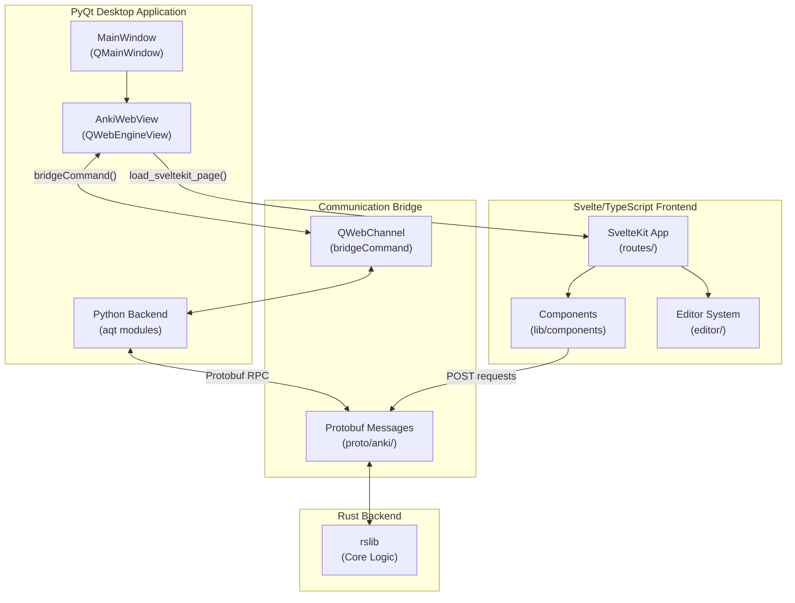

# Anki UI Architecture Overview

## Introduction

Anki's user interface is built using a dual-layer architecture that combines modern web technologies with a native desktop framework. This document provides an overview of the UI structure, navigation between components, and the communication patterns between layers.

## Architecture Layers

Anki's UI consists of two main layers:

1. **Web Frontend** (`ts/`): Modern Svelte/TypeScript components providing the primary user interface
2. **Desktop Container** (`qt/aqt/`): PyQt6 application that embeds web views and provides native desktop integration

### Layer Communication



## Web Frontend Structure

The web frontend is located in [`ts/`](/home/felipe/Projects/anki/ts/) and uses SvelteKit for routing and component organization.

### Key Directories

- **`ts/routes/`**: Page-level components (SvelteKit routes)
  - `deck-options/`: Deck configuration interface
  - `graphs/`: Statistics and visualization
  - `image-occlusion/`: Image masking editor
  - `card-info/`, `change-notetype/`, `congrats/`, `import-*`: Various dialogs and pages

- **`ts/editor/`**: Note editing system
  - `NoteEditor.svelte`: Main editor component
  - `BrowserEditor.svelte`, `ReviewerEditor.svelte`: Context-specific editors
  - `editor-toolbar/`: Toolbar with formatting buttons
  - `rich-text-input/`, `plain-text-input/`: Input components

- **`ts/lib/components/`**: Reusable UI primitives
  - Layout: `Container`, `Row`, `Col`, `Collapsible`
  - Form controls: `Button`, `CheckBox`, `Select`, `SpinBox`, `Switch`
  - Overlays: `Popover`, `Tooltip`, `WithOverlay`
  - Data display: `Badge`, `Icon`, `VirtualTable`

- **`ts/lib/tag-editor/`**: Tag editing components
- **`ts/reviewer/`**: Card review interface scripts

### Entry Point

The application entry point is [`ts/routes/+layout.svelte`](/home/felipe/Projects/anki/ts/routes/+layout.svelte), which:
- Sets up global context (modals, touch device detection)
- Imports base styles
- Provides the root layout for all routes

## Desktop UI Structure

The desktop UI is located in [`qt/aqt/`](/home/felipe/Projects/anki/qt/aqt/) and provides the native application shell.

### Key Components

- **`main.py`**: `AnkiQt` class - Main application window
- **`webview.py`**: `AnkiWebView` class - QWebEngineView wrapper that embeds Svelte pages
- **`forms/`**: Qt Designer UI files (`.ui`) and their Python controllers
  - `main.ui`: Main window layout
  - `browser.ui`: Card browser dialog
  - `addcards.ui`: Add cards dialog
  - `preferences.ui`: Settings dialog
  - And 38+ other dialogs

### WebView Integration

The `AnkiWebView` class ([`qt/aqt/webview.py`](/home/felipe/Projects/anki/qt/aqt/webview.py)):
- Loads SvelteKit pages via `load_sveltekit_page(path)`
- Provides `bridgeCommand()` for JavaScript → Python communication
- Handles theme injection and styling
- Manages navigation and link handling

## Communication Patterns

### JavaScript → Python

Web components communicate with Python using `bridgeCommand()`:

```typescript
import { bridgeCommand } from "@tslib/bridgecommand";

// Send command to Python backend
bridgeCommand(`saveTags:${JSON.stringify(tags)}`);
```

The Python side handles these in webview command handlers (e.g., `onBridgeCmd` methods).

### Python → JavaScript

Python can execute JavaScript in webviews:

```python
self.web.eval("setupEditor('add')")
self.web.evalWithCallback(js_code, callback)
```

### Backend Communication

Both layers communicate with the Rust backend via:
- **Protobuf RPC**: Type-safe method calls defined in `proto/anki/`
- **TypeScript**: `@generated/backend` module provides typed RPC methods
- **Python**: `anki._backend` module wraps Rust functions

## Navigation Structure

### Web Pages

Web pages are accessed via SvelteKit routing:
- Route files: `ts/routes/[page-name]/+page.svelte`
- Layout: `ts/routes/+layout.svelte`
- Loaded by: `webview.load_sveltekit_page("/route-path")`

### Qt Dialogs

Qt dialogs are instantiated from Python:
- UI files: `qt/aqt/forms/[name].ui`
- Controllers: `qt/aqt/[name].py`
- Opened via: `dialog = DialogClass(mw)` then `dialog.exec()`

## Documentation Organization

This documentation is organized into sections:

1. **[01-web-pages/](01-web-pages/)**: Detailed documentation of SvelteKit route pages
2. **[02-web-components/](02-web-components/)**: Shared component libraries
3. **[03-qt-forms/](03-qt-forms/)**: Qt desktop forms and dialogs
4. **[04-data-flows.md](04-data-flows.md)**: Cross-layer communication patterns

## Key Technologies

- **SvelteKit**: Web framework for routing and SSR (disabled in Anki)
- **TypeScript**: Type-safe JavaScript
- **SCSS**: Styling with CSS preprocessing
- **PyQt6**: Python bindings for Qt6
- **QWebEngine**: Chromium-based web view
- **Protocol Buffers**: Cross-language data serialization
- **Rust**: Core backend logic (rslib)

## Theme and Styling

- Themes are managed by `aqt.theme.theme_manager`
- CSS variables are injected into web pages
- Night mode is detected and applied via body classes
- Stylesheets are located in:
  - `ts/lib/sass/`: Shared SCSS files
  - `ts/routes/*/base.scss`: Page-specific styles
  - `qt/aqt/data/web/css/`: Legacy CSS files

## Next Steps

- Read about specific pages in [01-web-pages/](01-web-pages/)
- Understand shared components in [02-web-components/](02-web-components/)
- Explore Qt dialogs in [03-qt-forms/](03-qt-forms/)
- Learn about data flows in [04-data-flows.md](04-data-flows.md)
