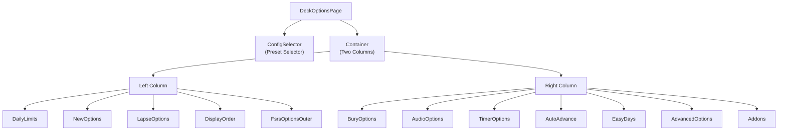
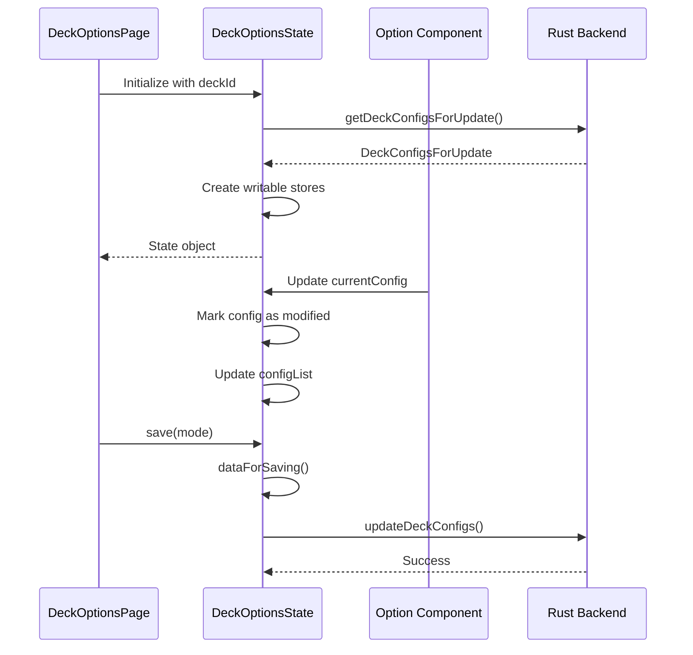

# Deck Options Page

## Overview

The Deck Options page (`ts/routes/deck-options/`) is a comprehensive interface for configuring deck settings, scheduling algorithms (SM-2 and FSRS), and daily limits. It consists of 41 components organized into a two-column responsive layout.

**Route**: `/deck-options/[deckId]`  
**Main Component**: [`DeckOptionsPage.svelte`](/home/felipe/Projects/anki/ts/routes/deck-options/DeckOptionsPage.svelte)  
**State Management**: [`lib.ts`](/home/felipe/Projects/anki/ts/routes/deck-options/lib.ts) - `DeckOptionsState` class

## Purpose

The Deck Options page allows users to:
- Configure scheduling parameters (new cards, reviews, lapses)
- Set daily limits for new cards and reviews
- Choose between SM-2 and FSRS scheduling algorithms
- Manage multiple configuration presets
- Customize audio, timer, and display options
- Configure advanced settings like card state customizers

## Page Structure



## Component Hierarchy

### Top Level

- **`DeckOptionsPage.svelte`**: Main page component
  - **`ConfigSelector.svelte`**: Preset selector and save button (sticky header)
  - **`Container`**: Two-column responsive grid layout

### Left Column Components

1. **`DailyLimits.svelte`**: Daily limits for new cards and reviews
   - Uses `TabbedValue` for preset/deck/today limits
   - Includes warnings for review limits too low
   - Global settings: `newCardsIgnoreReviewLimit`, `applyAllParentLimits`

2. **`NewOptions.svelte`**: New card scheduling options
   - Learning steps input
   - Graduating interval (SM-2 only)
   - Easy interval (SM-2 only)
   - New card insertion order

3. **`LapseOptions.svelte`**: Lapse/relearning options
   - Relearning steps
   - Minimum interval (SM-2 only)
   - Leech threshold and action

4. **`DisplayOrder.svelte`**: Card display order settings

5. **`FsrsOptionsOuter.svelte`**: FSRS algorithm configuration
   - Toggle FSRS on/off
   - Contains `FsrsOptions.svelte` with detailed FSRS parameters

### Right Column Components

1. **`BuryOptions.svelte`**: Card burying settings

2. **`AudioOptions.svelte`**: Audio playback options

3. **`TimerOptions.svelte`**: Review timer settings

4. **`AutoAdvance.svelte`**: Auto-advance configuration

5. **`EasyDays.svelte`**: Easy button interval settings

6. **`AdvancedOptions.svelte`**: Advanced configuration options

7. **`Addons.svelte`**: Add-on specific options (conditionally rendered)

## State Management

### DeckOptionsState Class

The `DeckOptionsState` class ([`lib.ts`](/home/felipe/Projects/anki/ts/routes/deck-options/lib.ts)) manages all configuration state:

```typescript
export class DeckOptionsState {
    readonly currentConfig: Writable<DeckConfig_Config>;
    readonly currentAuxData: Writable<Record<string, unknown>>;
    readonly configList: Readable<ConfigListEntry[]>;
    readonly cardStateCustomizer: Writable<string>;
    readonly currentDeck: DeckConfigsForUpdate_CurrentDeck;
    readonly deckLimits: Writable<DeckConfigsForUpdate_CurrentDeck_Limits>;
    readonly defaults: DeckConfig_Config;
    readonly addonComponents: Writable<DynamicSvelteComponent[]>;
    readonly newCardsIgnoreReviewLimit: Writable<boolean>;
    readonly applyAllParentLimits: Writable<boolean>;
    readonly fsrs: Writable<boolean>;
    readonly fsrsReschedule: Writable<boolean>;
    // ... more state
}
```

### Key State Properties

- **`currentConfig`**: Currently selected preset's configuration
- **`configList`**: List of all available presets with use counts
- **`deckLimits`**: Deck-specific limits (v3 feature)
- **`fsrs`**: Whether FSRS algorithm is enabled
- **`addonComponents`**: Dynamic components from add-ons

### State Flow



## Key Components

### ConfigSelector

**File**: [`ConfigSelector.svelte`](/home/felipe/Projects/anki/ts/routes/deck-options/ConfigSelector.svelte)

The preset selector provides:
- Dropdown to select configuration preset
- Save button with dropdown menu
- Add/Clone/Rename/Remove preset actions
- Sticky positioning at top of page

**Props**:
- `state: DeckOptionsState`

**Events**:
- `presetchange`: Fired when preset selection changes

### DailyLimits

**File**: [`DailyLimits.svelte`](/home/felipe/Projects/anki/ts/routes/deck-options/DailyLimits.svelte)

Manages daily limits with three-tier system:
1. **Shared Preset**: Limit from the selected preset (applies to all decks using preset)
2. **Deck Only**: Limit specific to this deck
3. **Today Only**: Temporary limit for today only

**Features**:
- `TabbedValue` component for switching between limit types
- Validation warning if review limit is too low
- Global settings for ignoring review limits and applying parent limits

**State Bindings**:
- `$config.newPerDay` / `$config.reviewsPerDay`: Preset limits
- `$limits.new` / `$limits.review`: Deck-specific limits
- `$limits.newToday` / `$limits.reviewToday`: Today-only limits

### NewOptions

**File**: [`NewOptions.svelte`](/home/felipe/Projects/anki/ts/routes/deck-options/NewOptions.svelte)

Configures new card scheduling:

**SM-2 Settings** (when FSRS disabled):
- Learning steps: Minutes between reviews during learning
- Graduating interval: Days after "Good" button
- Easy interval: Days after "Easy" button

**FSRS Settings** (when FSRS enabled):
- Learning steps only (graduating/easy intervals not used)

**Other Settings**:
- New card insertion order: Sequential or random

**Validation**:
- Warns if learning steps exceed graduating interval
- Warns if learning steps >= 1 day with FSRS enabled

### LapseOptions

**File**: [`LapseOptions.svelte`](/home/felipe/Projects/anki/ts/routes/deck-options/LapseOptions.svelte)

Configures lapse (forgot card) behavior:

- **Relearning steps**: Minutes between reviews when relearning
- **Minimum interval** (SM-2 only): Minimum days before showing lapsed card again
- **Leech threshold**: Number of lapses before marking as leech
- **Leech action**: What to do with leeches (suspend, tag, or nothing)

### FsrsOptionsOuter

**File**: [`FsrsOptionsOuter.svelte`](/home/felipe/Projects/anki/ts/routes/deck-options/FsrsOptionsOuter.svelte)

Wrapper for FSRS configuration. Contains:
- Toggle to enable/disable FSRS
- `FsrsOptions.svelte` component (shown when FSRS enabled)
  - Desired retention slider
  - Model weights/parameters
  - Reschedule cards on change option
  - Health check toggle

### SaveButton

**File**: [`SaveButton.svelte`](/home/felipe/Projects/anki/ts/routes/deck-options/SaveButton.svelte)

Save button with dropdown menu:

**Actions**:
- **Save**: Save changes to current deck only
- **Save to All Subdecks**: Apply changes to all child decks
- **Add Group**: Create new preset
- **Clone Group**: Duplicate current preset
- **Rename Group**: Rename current preset
- **Remove Group**: Delete current preset (if not default)

**Keyboard Shortcut**: `Ctrl+Enter` (or `Cmd+Enter` on Mac)

## Data Loading

The page data is loaded via SvelteKit's `load` function:

**File**: [`[deckId]/+page.ts`](/home/felipe/Projects/anki/ts/routes/deck-options/[deckId]/+page.ts)

```typescript
export const load = async ({ params }) => {
    const deckId = Number(params.deckId);
    const did = BigInt(deckId);
    const info = await getDeckConfigsForUpdate({ did });
    const state = new DeckOptionsState(BigInt(did), info);
    return { state };
};
```

## Saving Changes

Changes are saved via the `DeckOptionsState.save()` method:

```typescript
async save(mode: UpdateDeckConfigsMode): Promise<void> {
    await updateDeckConfigs(this.dataForSaving(mode));
}
```

**Save Modes**:
- `NORMAL`: Save to current deck only
- `APPLY_TO_CHILDREN`: Apply to all subdecks

## Change Detection

The state tracks modifications by:
1. Comparing current configs with original configs (loaded on mount)
2. Tracking modified config IDs in `modifiedConfigs` Set
3. Tracking removed config IDs in `removedConfigs` array
4. Using `isModified()` method to check if any changes exist

**Original Config Resolution**:
- Components may modify config during initialization
- `originalConfigsPromise` is resolved after all components mount
- Ensures accurate change detection

## Preset Management

### Adding Presets

```typescript
state.addConfig(name: string): void
```
- Creates new preset from defaults
- Makes it the current preset

### Cloning Presets

```typescript
state.cloneConfig(name: string): void
```
- Duplicates current preset
- Makes clone the current preset

### Renaming Presets

```typescript
state.setCurrentName(name: string): void
```
- Renames current preset
- Ensures unique name (appends timestamp if duplicate)

### Removing Presets

```typescript
state.removeCurrentConfig(): void
```
- Removes current preset (cannot remove default)
- May trigger full sync if preset was in use

## Responsive Layout

The page uses a two-column layout on large screens:

```scss
.container-columns {
    display: grid;
    gap: 0px;
    
    @include bp.with-breakpoint("lg") {
        grid-template-columns: repeat(2, 1fr);
        gap: 20px;
    }
}
```

On smaller screens, columns stack vertically.

## Help System

Each option section includes:
- **Help Modal**: Accessible via `?` icon
- **Help Sections**: Multiple help items with descriptions
- **Help Pages**: Links to online documentation
- **Scheduler-Specific Help**: Different help for SM-2 vs FSRS

**Component**: `HelpModal.svelte` with Bootstrap carousel for multiple help sections

## Add-on Integration

Add-ons can inject components via:
- `state.addSvelteAddon(component)`: Add Svelte component
- `state.addHtmlAddon(html, mounted)`: Add HTML content

Add-on components are rendered in the `Addons.svelte` section.

## Validation and Warnings

Several components show validation warnings:

- **DailyLimits**: Warns if review limit is too low relative to new card limit
- **NewOptions**: Warns if learning steps exceed graduating interval
- **NewOptions**: Warns if learning steps >= 1 day with FSRS
- **LapseOptions**: Warns if relearning steps exceed minimum interval

Warnings are displayed using the `Warning.svelte` component.

## Key Files Reference

- **Main Page**: [`DeckOptionsPage.svelte`](/home/felipe/Projects/anki/ts/routes/deck-options/DeckOptionsPage.svelte)
- **State Management**: [`lib.ts`](/home/felipe/Projects/anki/ts/routes/deck-options/lib.ts)
- **Route Loader**: [`[deckId]/+page.ts`](/home/felipe/Projects/anki/ts/routes/deck-options/[deckId]/+page.ts)
- **Preset Selector**: [`ConfigSelector.svelte`](/home/felipe/Projects/anki/ts/routes/deck-options/ConfigSelector.svelte)
- **Save Button**: [`SaveButton.svelte`](/home/felipe/Projects/anki/ts/routes/deck-options/SaveButton.svelte)
- **Daily Limits**: [`DailyLimits.svelte`](/home/felipe/Projects/anki/ts/routes/deck-options/DailyLimits.svelte)
- **New Options**: [`NewOptions.svelte`](/home/felipe/Projects/anki/ts/routes/deck-options/NewOptions.svelte)
- **Lapse Options**: [`LapseOptions.svelte`](/home/felipe/Projects/anki/ts/routes/deck-options/LapseOptions.svelte)
- **FSRS Options**: [`FsrsOptionsOuter.svelte`](/home/felipe/Projects/anki/ts/routes/deck-options/FsrsOptionsOuter.svelte)
