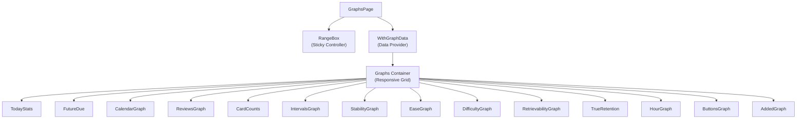
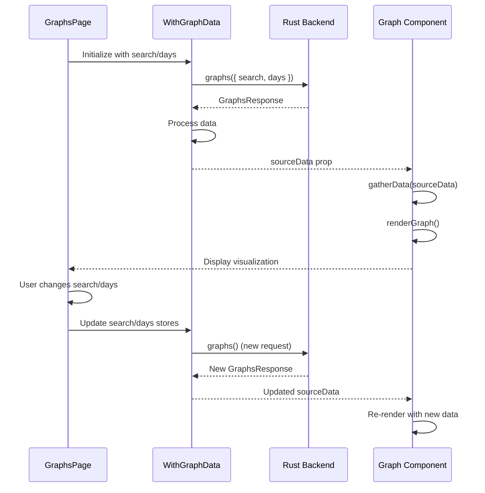

# Graphs and Statistics Page

## Overview

The Graphs page (`ts/routes/graphs/`) provides comprehensive visualization of study statistics, card performance, and scheduling data. It consists of 51 files including 15 different graph components, data processing utilities, and shared visualization helpers.

**Route**: `/graphs` (loaded via `setupGraphs()` function)  
**Main Component**: [`GraphsPage.svelte`](/home/felipe/Projects/anki/ts/routes/graphs/GraphsPage.svelte)  
**Entry Point**: [`index.ts`](/home/felipe/Projects/anki/ts/routes/graphs/index.ts) - `setupGraphs()` function

## Purpose

The Graphs page allows users to:
- View study statistics over time (reviews, cards added, etc.)
- Analyze card performance (ease, difficulty, intervals)
- Visualize scheduling data (stability, retrievability)
- Filter by deck, collection, or custom search
- Adjust time ranges (month, 3 months, year, all time)
- Export and analyze study patterns

## Page Structure



## Component Hierarchy

### Top Level

- **`GraphsPage.svelte`**: Main page component
  - Accepts array of graph components
  - Manages search and days state
  - Renders controller (RangeBox) and graphs container

- **`WithGraphData.svelte`**: Data fetching wrapper
  - Fetches graph data from backend
  - Manages loading state
  - Provides data to child graphs via slot props

- **`RangeBox.svelte`**: Sticky controller at top
  - Search filter (deck/collection/custom)
  - Time range selector (year/all)
  - Loading indicator

### Graph Components

All graphs follow a common pattern:
1. Receive `sourceData: GraphsResponse | null` prop
2. Process data using helper functions
3. Render using D3.js or simple HTML
4. Wrap in `Graph.svelte` component for consistent styling

**Graph List** (in display order):

1. **`TodayStats.svelte`**: Today's study statistics
   - Simple text display
   - Shows cards studied, time spent, etc.

2. **`FutureDue.svelte`**: Future due cards visualization
   - Shows cards due in coming days/weeks

3. **`CalendarGraph.svelte`**: Calendar heatmap
   - Daily activity visualization
   - Color-coded by intensity

4. **`ReviewsGraph.svelte`**: Reviews over time
   - Line/bar chart showing review counts
   - Toggle between count and time
   - Range selector (month/3 months/year/all)

5. **`CardCounts.svelte`**: Card counts by type
   - Shows new, learning, review cards
   - Stacked or grouped visualization

6. **`IntervalsGraph.svelte`**: Review intervals distribution
   - Histogram of interval lengths
   - Shows spacing distribution

7. **`StabilityGraph.svelte`**: Memory stability (FSRS)
   - Stability values over time
   - FSRS-specific metric

8. **`EaseGraph.svelte`**: Ease factor distribution
   - Histogram of ease values
   - Shows card difficulty distribution

9. **`DifficultyGraph.svelte`**: Difficulty ratings (FSRS)
   - Difficulty distribution
   - FSRS-specific metric

10. **`RetrievabilityGraph.svelte`**: Retrievability over time (FSRS)
    - Shows memory strength over time
    - FSRS-specific metric

11. **`TrueRetention.svelte`**: True retention analysis
    - Retention rate calculations
    - Combined and single views

12. **`HourGraph.svelte`**: Study activity by hour
    - Shows when user studies most
    - Hourly distribution

13. **`ButtonsGraph.svelte`**: Button usage statistics
    - Distribution of Again/Good/Easy/Hard
    - Shows user behavior patterns

14. **`AddedGraph.svelte`**: Cards added over time
    - Timeline of new card creation
    - Shows deck growth

## Data Flow



## State Management

### Search State

- **`search: Writable<string>`**: Search filter
  - `"deck:current"`: Current deck only
  - `""`: Entire collection
  - Custom search string: User-defined filter

### Days State

- **`days: Writable<number>`**: Time range in days
  - `365`: One year
  - `0`: All time
  - Custom number: Specific day range

### Revlog Range

Converted from days:
- **`RevlogRange.Year`**: Last 365 days
- **`RevlogRange.All`**: All history

### Graph Range

Display period for individual graphs:
- **`GraphRange.Month`**: Last 31 days
- **`GraphRange.ThreeMonths`**: Last 90 days
- **`GraphRange.Year`**: Last 365 days
- **`GraphRange.AllTime`**: All available data

## Key Components

### GraphsPage

**File**: [`GraphsPage.svelte`](/home/felipe/Projects/anki/ts/routes/graphs/GraphsPage.svelte)

Main page component that:
- Accepts array of graph components
- Manages initial search and days
- Renders controller and graphs in responsive grid

**Props**:
- `graphs: Component<any>[]`: Array of graph components to render
- `initialSearch: string`: Initial search filter
- `initialDays: number`: Initial time range
- `controller: Component<any> | null`: Controller component (default: RangeBox)

**Layout**:
- Responsive grid: 3 columns on large screens, 2 on medium, 1 on small
- Controller (RangeBox) is sticky at top
- Graphs render below in grid

### WithGraphData

**File**: [`WithGraphData.svelte`](/home/felipe/Projects/anki/ts/routes/graphs/WithGraphData.svelte)

Data provider component that:
- Fetches graph data from backend
- Manages loading state
- Provides data to children via slot props

**Slot Props**:
- `sourceData: GraphsResponse | null`: Graph data from backend
- `loading: boolean`: Loading state
- `prefs: GraphPreferences`: User preferences
- `revlogRange: RevlogRange`: Converted range

**Data Fetching**:
```typescript
async function updateSourceData(search: string, days: number) {
    loading = true;
    try {
        sourceData = await graphs({ search, days });
    } finally {
        loading = false;
    }
}
```

### RangeBox

**File**: [`RangeBox.svelte`](/home/felipe/Projects/anki/ts/routes/graphs/RangeBox.svelte)

Sticky controller at top of page:

**Features**:
- Search filter radio buttons (Deck/Collection/Custom)
- Custom search text input (external API - used by AnkiDroid)
- Time range selector (Year/All)
- Loading spinner

**State Management**:
- `searchRange: SearchRange`: Current search mode
- `revlogRange: RevlogRange`: Current time range
- Updates parent stores when changed

**Styling**:
- Sticky positioning at top
- Loading spinner overlay
- Responsive layout

### Graph

**File**: [`Graph.svelte`](/home/felipe/Projects/anki/ts/routes/graphs/Graph.svelte)

Wrapper component for consistent graph styling:

**Props**:
- `title: string | null`: Graph title (null = inline, no container)
- `subtitle: string | null`: Optional subtitle

**Features**:
- Wraps in `TitledContainer` if title provided
- Provides consistent styling for D3 graphs
- Handles tick styling and responsive text sizing
- Focus management for accessibility

### ReviewsGraph

**File**: [`ReviewsGraph.svelte`](/home/felipe/Projects/anki/ts/routes/graphs/ReviewsGraph.svelte)

Complex graph showing review statistics:

**Features**:
- Toggle between count and time views
- Range selector (month/3 months/year/all)
- Bar chart with cumulative overlay
- Hover tooltips
- Data table below graph

**Data Processing**:
- Uses `gatherData()` from `reviews.ts`
- Renders with D3.js
- Updates on data/range changes

**Components Used**:
- `GraphRangeRadios`: Range selector
- `CumulativeOverlay`: Cumulative line overlay
- `HoverColumns`: Hover tooltips
- `AxisTicks`: Axis labels
- `TableData`: Data table

## Data Processing

### Graph Helpers

**File**: [`graph-helpers.ts`](/home/felipe/Projects/anki/ts/routes/graphs/graph-helpers.ts)

Common utilities for all graphs:

- **`RevlogRange`**: Enum for data fetch range
- **`GraphRange`**: Enum for display range
- **`GraphBounds`**: Interface for SVG dimensions
- **`defaultGraphBounds()`**: Standard graph dimensions
- **`millisecondCutoffForRange()`**: Calculate time cutoff
- **`numericMap()`**: Convert protobuf maps
- **`setDataAvailable()`**: Show/hide "no data" overlay

### Individual Graph Data Processing

Each graph has a corresponding TypeScript file for data processing:

- **`today.ts`**: Process today's statistics
- **`reviews.ts`**: Process review data
- **`intervals.ts`**: Process interval data
- **`ease.ts`**: Process ease factor data
- **`difficulty.ts`**: Process difficulty data
- **`retrievability.ts`**: Process retrievability data
- **`true-retention.ts`**: Process retention calculations
- **`hours.ts`**: Process hourly data
- **`buttons.ts`**: Process button usage data
- **`added.ts`**: Process cards added data
- **`calendar.ts`**: Process calendar data
- **`future-due.ts`**: Process future due data
- **`card-counts.ts`**: Process card count data

## Responsive Layout

The graphs container uses CSS Grid:

```scss
.graphs-container {
    display: grid;
    gap: 1em;
    grid-template-columns: repeat(3, minmax(0, 1fr));
    
    @media (max-width: 1400px) {
        grid-template-columns: 1fr 1fr;
    }
    
    @media (max-width: 1200px) {
        grid-template-columns: 1fr;
    }
    
    @media (max-width: 600px) {
        font-size: 12px;
    }
}
```

## D3.js Integration

Most graphs use D3.js for rendering:

- **Selection API**: Select and manipulate SVG elements
- **Scales**: Map data to pixel coordinates
- **Axes**: Generate axis labels and ticks
- **Transitions**: Animate updates
- **Brushes**: Interactive selection (some graphs)

**Common Pattern**:
```typescript
import { select } from "d3";
import { scaleLinear, scaleTime } from "d3-scale";
import { axisBottom, axisLeft } from "d3-axis";

// Create scales
const xScale = scaleTime().domain([minDate, maxDate]).range([0, width]);
const yScale = scaleLinear().domain([0, maxValue]).range([height, 0]);

// Render axes
svg.select(".x-axis").call(axisBottom(xScale));
svg.select(".y-axis").call(axisLeft(yScale));

// Render data
svg.selectAll(".bar")
    .data(data)
    .enter()
    .append("rect")
    .attr("x", d => xScale(d.date))
    .attr("y", d => yScale(d.value))
    .attr("width", xScale.bandwidth())
    .attr("height", d => height - yScale(d.value));
```

## Preferences

Graph preferences are stored and auto-saved:

**File**: Uses `autoSavingPrefs()` from `$lib/sveltelib/preferences`

**Preferences Include**:
- Graph visibility toggles
- Default ranges
- Display options
- User customizations

## Browser Search Integration

Graphs can trigger browser searches:

**Event**: `search` event with `{ query: string }` detail

**Handler**:
```typescript
function browserSearch(event: CustomEvent) {
    bridgeCommand(`browserSearch: ${$search} ${event.detail.query}`);
}
```

This opens the card browser with the combined search query.

## External API

The search input has ID `statisticsSearchText` for external access:

- **AnkiDroid**: Programmatically updates search via this input
- **Other clients**: Can interact with the form by ID

## Key Files Reference

- **Main Page**: [`GraphsPage.svelte`](/home/felipe/Projects/anki/ts/routes/graphs/GraphsPage.svelte)
- **Entry Point**: [`index.ts`](/home/felipe/Projects/anki/ts/routes/graphs/index.ts)
- **Route**: [`+page.svelte`](/home/felipe/Projects/anki/ts/routes/graphs/+page.svelte)
- **Data Provider**: [`WithGraphData.svelte`](/home/felipe/Projects/anki/ts/routes/graphs/WithGraphData.svelte)
- **Controller**: [`RangeBox.svelte`](/home/felipe/Projects/anki/ts/routes/graphs/RangeBox.svelte)
- **Graph Wrapper**: [`Graph.svelte`](/home/felipe/Projects/anki/ts/routes/graphs/Graph.svelte)
- **Helpers**: [`graph-helpers.ts`](/home/felipe/Projects/anki/ts/routes/graphs/graph-helpers.ts)
- **Reviews Graph**: [`ReviewsGraph.svelte`](/home/felipe/Projects/anki/ts/routes/graphs/ReviewsGraph.svelte)
- **Today Stats**: [`TodayStats.svelte`](/home/felipe/Projects/anki/ts/routes/graphs/TodayStats.svelte)
