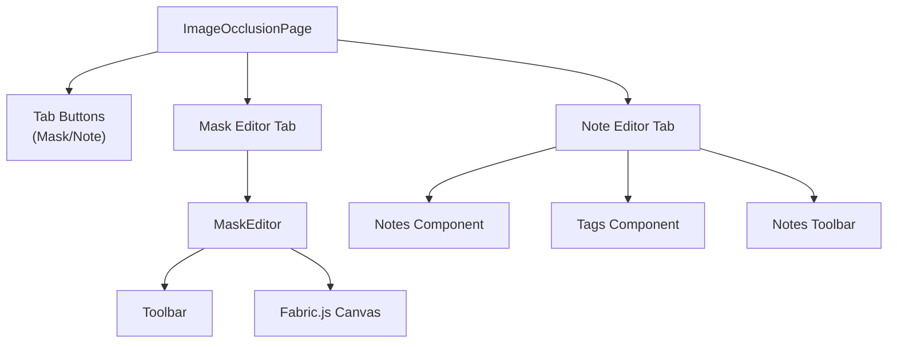
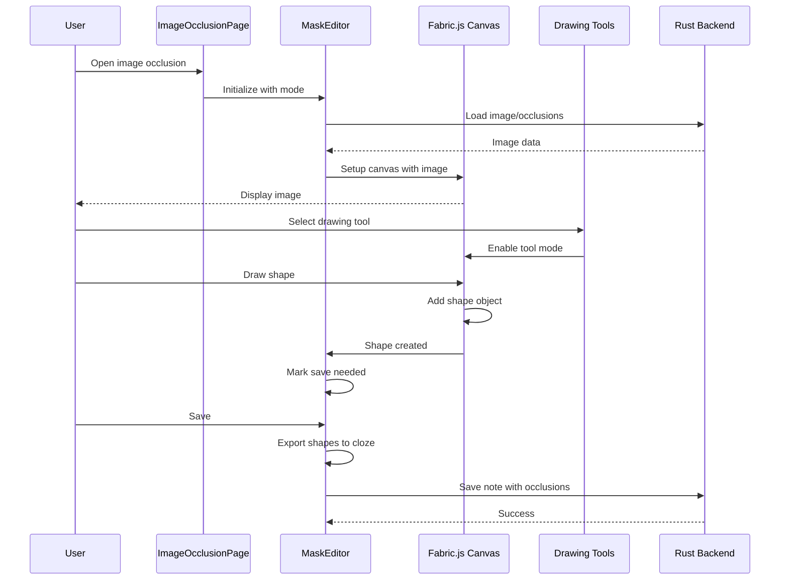

# Image Occlusion Editor

## Overview

The Image Occlusion editor (`ts/routes/image-occlusion/`) is a sophisticated canvas-based tool for creating masked regions on images for cloze deletion cards. It consists of 53 files including Fabric.js canvas integration, shape drawing tools, and note editing components.

**Route**: `/image-occlusion/[...imagePathOrNoteId]`  
**Main Component**: [`ImageOcclusionPage.svelte`](/home/felipe/Projects/anki/ts/routes/image-occlusion/ImageOcclusionPage.svelte)  
**Canvas Editor**: [`MaskEditor.svelte`](/home/felipe/Projects/anki/ts/routes/image-occlusion/MaskEditor.svelte)

## Purpose

The Image Occlusion editor allows users to:
- Draw shapes (rectangles, ellipses, polygons, text) on images
- Create masked regions for cloze deletion cards
- Edit existing occlusions on notes
- Switch between mask editor and note editor tabs
- Export shapes to cloze deletion format
- Manage tags and note fields

## Page Structure



## Component Hierarchy

### Top Level

- **`ImageOcclusionPage.svelte`**: Main page with tab switching
  - Tab buttons: Mask Editor / Note Editor
  - Conditionally renders MaskEditor or Notes based on active tab

- **`ImageOcclusionPicker.svelte`**: Image selection interface
  - Shown when no image is loaded
  - Options to pick from file or clipboard

### Mask Editor

- **`MaskEditor.svelte`**: Canvas editor container
  - Initializes Fabric.js canvas
  - Manages canvas lifecycle
  - Handles image loading
  - Dispatches save events

- **`Toolbar.svelte`**: Drawing tools toolbar
  - Left sidebar: Drawing tools (cursor, rectangle, ellipse, polygon, text, fill)
  - Top bar: Mode selector, undo/redo, zoom, opacity, delete/duplicate, group/align

### Note Editor

- **`Notes.svelte`**: Note fields editor
- **`Tags.svelte`**: Tag management
- **`NotesToolbar.svelte`**: Note editing toolbar
  - Text formatting
  - More tools dropdown

## Editor Modes

The editor supports three modes defined in [`lib.ts`](/home/felipe/Projects/anki/ts/routes/image-occlusion/lib.ts):

```typescript
export interface IOAddingMode {
    kind: "add";
    notetypeId: number;
    imagePath: string;
}

export interface IOCloningMode {
    kind: "add";
    clonedNoteId: number;
}

export interface IOEditingMode {
    kind: "edit";
    noteId: number;
}

export type IOMode = IOAddingMode | IOEditingMode | IOCloningMode;
```

- **Adding Mode**: Creating new image occlusion note
- **Cloning Mode**: Cloning occlusions from existing note
- **Editing Mode**: Editing existing note's occlusions

## State Management

### Stores

**File**: [`store.ts`](/home/felipe/Projects/anki/ts/routes/image-occlusion/store.ts)

- **`ioMaskEditorVisible`**: Visibility of mask editor (vs note editor)
- **`hideAllGuessOne`**: Occlusion mode (hide all vs hide one)
- **`ioImageLoadedStore`**: Whether image is loaded
- **`opacityStateStore`**: Mask opacity state
- **`textEditingState`**: Whether text is being edited
- **`saveNeededStore`**: Whether canvas needs saving
- **`tagsWritable`**: Tags for the note
- **`notesDataStore`**: Note data for generation

## Drawing Tools

### Tool System

**File**: [`tools/tool-buttons.ts`](/home/felipe/Projects/anki/ts/routes/image-occlusion/tools/tool-buttons.ts)

Tools are defined with:
- ID, icon, tooltip, shortcut
- Icon size multiplier
- Activation handler

### Available Tools

1. **Cursor** (`tool-cursor.ts`): Selection and manipulation
   - Select shapes
   - Move, resize, rotate
   - Keyboard shortcut: `V`

2. **Draw Rectangle** (`tool-rect.ts`): Draw rectangular masks
   - Click and drag to create
   - Keyboard shortcut: `R`

3. **Draw Ellipse** (`tool-ellipse.ts`): Draw elliptical masks
   - Click and drag to create
   - Keyboard shortcut: `O`

4. **Draw Polygon** (`tool-polygon.ts`): Draw polygonal masks
   - Click to add vertices
   - Double-click or Enter to finish
   - Keyboard shortcut: `P`

5. **Draw Text** (`tool-text.ts`): Add text labels
   - Click to place text
   - Editable text input
   - Keyboard shortcut: `T`

6. **Fill Mask** (`tool-fill.ts`): Fill area with color
   - Click to fill connected area
   - Color picker integration
   - Keyboard shortcut: `F`

### Tool Activation

Tools are activated via `handleToolChanges()` in Toolbar:

```typescript
function handleToolChanges(newActiveTool: ActiveTool) {
    disableFunctions();
    enableSelectable(canvas, true);
    removeUnfinishedPolygon(canvas);
    
    switch (newActiveTool) {
        case "cursor":
            drawCursor(canvas);
            break;
        case "draw-rectangle":
            drawRectangle(canvas);
            break;
        // ... other tools
    }
}
```

## Canvas Management

### Fabric.js Integration

The editor uses Fabric.js for canvas rendering:

- **Canvas Setup**: Initialized in `mask-editor.ts`
- **Image Loading**: Loads image as background
- **Shape Management**: All shapes are Fabric.js objects
- **Event Handling**: Mouse, keyboard, touch events

### Canvas API

**File**: [`tools/api.ts`](/home/felipe/Projects/anki/ts/routes/image-occlusion/tools/api.ts)

`MaskEditorAPI` class provides:
- Canvas access
- Shape manipulation methods
- Export/import functionality

## Shape System

### Shape Types

**Directory**: [`shapes/`](/home/felipe/Projects/anki/ts/routes/image-occlusion/shapes/)

- **`rectangle.ts`**: Rectangle shape implementation
- **`ellipse.ts`**: Ellipse shape implementation
- **`polygon.ts`**: Polygon shape implementation
- **`text.ts`**: Text shape implementation
- **`base.ts`**: Base shape interface

### Shape Conversion

- **`to-cloze.ts`**: Convert shapes to cloze deletion format
- **`from-cloze.ts`**: Load shapes from cloze deletions

### Shape Properties

Shapes have:
- Position (x, y)
- Size (width, height)
- Color/fill
- Stroke properties
- Cloze index (for cloze deletions)

## Toolbar Components

### Left Sidebar

**File**: [`Toolbar.svelte`](/home/felipe/Projects/anki/ts/routes/image-occlusion/Toolbar.svelte)

Vertical toolbar with drawing tools:
- Fixed position on left
- Active tool highlighted
- Keyboard shortcuts displayed
- Scrollable if many tools

### Top Toolbar

Horizontal toolbar with:
- **Mode Selector**: Hide all vs hide one
- **Undo/Redo**: Action history
- **Zoom Tools**: Zoom in/out/reset
- **Opacity Toggle**: Make masks translucent
- **Delete/Duplicate**: Shape manipulation
- **Group/Ungroup**: Shape grouping
- **Align Tools**: Alignment dropdown

## Keyboard Shortcuts

**File**: [`tools/shortcuts.ts`](/home/felipe/Projects/anki/ts/routes/image-occlusion/tools/shortcuts.ts)

- **Tool Selection**: `V`, `R`, `O`, `P`, `T`, `F`
- **Undo/Redo**: `Ctrl+Z`, `Ctrl+Shift+Z`
- **Zoom**: `Ctrl++`, `Ctrl+-`, `Ctrl+0`
- **Pan**: `Space` + drag
- **Opacity**: `Ctrl+Shift+T`
- **Delete**: `Delete` or `Backspace`

## Pan and Zoom

**File**: [`tools/tool-zoom.ts`](/home/felipe/Projects/anki/ts/routes/image-occlusion/tools/tool-zoom.ts)

- **Zoom**: `Ctrl` + mouse wheel
- **Pan**: `Space` + mouse drag
- **Horizontal Pan**: `Shift` + mouse wheel
- **Zoom In/Out**: Toolbar buttons
- **Reset Zoom**: Toolbar button

## Undo/Redo System

**File**: [`tools/tool-undo-redo.ts`](/home/felipe/Projects/anki/ts/routes/image-occlusion/tools/tool-undo-redo.ts)

- Tracks canvas state changes
- Undo/redo stack
- Integrates with Fabric.js history
- Disables buttons when no actions available

## Shape Operations

### Alignment

**File**: [`tools/tool-aligns.ts`](/home/felipe/Projects/anki/ts/routes/image-occlusion/tools/tool-aligns.ts)

- Align left/right/center
- Align top/bottom/middle
- Distribute horizontally/vertically

### Grouping

**File**: [`tools/more-tools.ts`](/home/felipe/Projects/anki/ts/routes/image-occlusion/tools/more-tools.ts)

- Group selected shapes
- Ungroup grouped shapes
- Keyboard shortcuts

### Delete/Duplicate

- Delete selected shapes
- Duplicate selected shapes
- Keyboard shortcuts

## Color Management

- Default mask color: `SHAPE_MASK_COLOR`
- Color picker with custom palette
- Custom colors saved to backend
- Fill tool uses selected color

## Export to Cloze

**File**: [`shapes/to-cloze.ts`](/home/felipe/Projects/anki/ts/routes/image-occlusion/shapes/to-cloze.ts)

Shapes are exported to cloze deletion format:
- Each shape becomes a cloze deletion
- Maintains order and properties
- Exported to note's occlusions field

## Notes Tab

When switching to Notes tab:
- Shows note fields editor
- Tag management
- Text formatting toolbar
- Note creation/editing

**Components**:
- `Notes.svelte`: Note fields
- `Tags.svelte`: Tag editor
- `NotesToolbar.svelte`: Formatting tools

## Integration with Note Editor

The Image Occlusion editor integrates with the main note editor:

- **Field Hiding**: Image and occlusions fields hidden in note editor
- **State Sync**: Editor state synchronized
- **Save Events**: Canvas changes trigger note saves
- **Image Loading**: Image loaded from note field

## Data Flow



## Key Files Reference

- **Main Page**: [`ImageOcclusionPage.svelte`](/home/felipe/Projects/anki/ts/routes/image-occlusion/ImageOcclusionPage.svelte)
- **Canvas Editor**: [`MaskEditor.svelte`](/home/felipe/Projects/anki/ts/routes/image-occlusion/MaskEditor.svelte)
- **Toolbar**: [`Toolbar.svelte`](/home/felipe/Projects/anki/ts/routes/image-occlusion/Toolbar.svelte)
- **Mode Types**: [`lib.ts`](/home/felipe/Projects/anki/ts/routes/image-occlusion/lib.ts)
- **Stores**: [`store.ts`](/home/felipe/Projects/anki/ts/routes/image-occlusion/store.ts)
- **Canvas Setup**: [`mask-editor.ts`](/home/felipe/Projects/anki/ts/routes/image-occlusion/mask-editor.ts)
- **Tool Buttons**: [`tools/tool-buttons.ts`](/home/felipe/Projects/anki/ts/routes/image-occlusion/tools/tool-buttons.ts)
- **Shape System**: [`shapes/`](/home/felipe/Projects/anki/ts/routes/image-occlusion/shapes/)
- **Export**: [`shapes/to-cloze.ts`](/home/felipe/Projects/anki/ts/routes/image-occlusion/shapes/to-cloze.ts)
