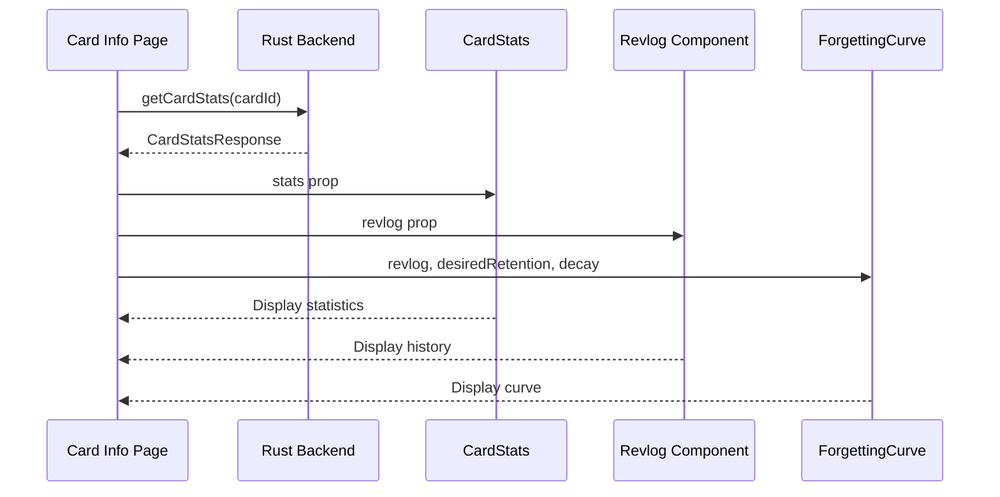
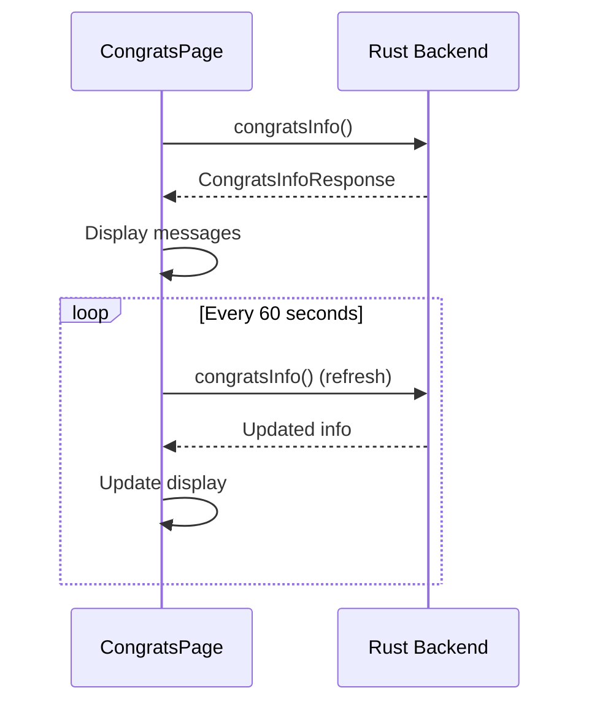
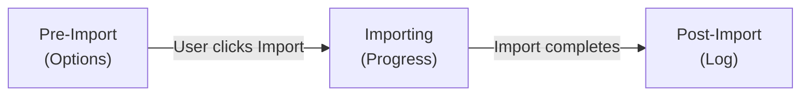

# Other Web Pages

This document covers the remaining web pages in Anki's UI: Card Info, Change Notetype, Congrats, and Import pages.

## Card Info Page

### Overview

The Card Info page displays detailed statistics and history for a specific card.

**Route**: `/card-info/[cardId]` or `/card-info/[cardId]/[previousId]`  
**Main Component**: [`CardInfo.svelte`](/home/felipe/Projects/anki/ts/routes/card-info/CardInfo.svelte)

### Purpose

Shows:
- Card statistics (ease, interval, due date, etc.)
- Review history (revlog entries)
- Forgetting curve (FSRS only)
- Card state information

### Components

- **`CardStats.svelte`**: Displays card statistics
  - Ease factor
  - Current interval
  - Due date
  - Memory state (FSRS)
  - Stability (FSRS)

- **`Revlog.svelte`**: Review history table
  - List of all reviews
  - Time, rating, interval
  - Button pressed

- **`ForgettingCurve.svelte`**: Forgetting curve visualization
  - Only shown when FSRS enabled
  - Shows retention probability over time
  - Uses desired retention and decay parameters

- **`CardInfoPlaceholder.svelte`**: Loading/empty state

### Data Flow



## Change Notetype Page

### Overview

The Change Notetype page allows users to change the note type of existing notes and map fields/templates between old and new types.

**Route**: `/change-notetype/[...notetypeIds]`  
**Main Component**: [`ChangeNotetypePage.svelte`](/home/felipe/Projects/anki/ts/routes/change-notetype/ChangeNotetypePage.svelte)

### Purpose

- Select target note type
- Map fields from old to new note type
- Map templates from old to new note type
- Preview changes before applying

### Components

- **`NotetypeSelector.svelte`**: Note type selection dropdown
  - Lists available note types
  - Sticky header

- **`Mapper.svelte`**: Field/template mapping interface
  - Shows old and new fields/templates
  - Dropdown to select mapping
  - Handles cloze conversion

- **`MapperRow.svelte`**: Individual mapping row
  - Old field/template name
  - Mapping selector
  - New field/template name

- **`StickyHeader.svelte`**: Column headers
  - "Old" and "New" labels
  - Sticky positioning

- **`SaveButton.svelte`**: Save changes button

- **`Alert.svelte`**: Warning messages
  - Cloze conversion warnings
  - Data loss warnings

### State Management

**File**: [`lib.ts`](/home/felipe/Projects/anki/ts/routes/change-notetype/lib.ts)

`ChangeNotetypeState` class manages:
- Source and target note types
- Field mappings
- Template mappings
- Validation state

### Mapping Context

Two mapping contexts:
- **`MapContext.Field`**: Field mapping
- **`MapContext.Template`**: Template mapping

### Special Cases

- **Cloze Conversion**: Converting to/from cloze note types
  - Shows special message
  - Handles cloze field mapping

- **Template Mapping**: Only shown if target has templates
  - Cloze note types don't have templates

## Congrats Page

### Overview

The Congrats page is displayed when a user finishes their daily reviews.

**Route**: `/congrats`  
**Main Component**: [`CongratsPage.svelte`](/home/felipe/Projects/anki/ts/routes/congrats/CongratsPage.svelte)

### Purpose

- Congratulate user on completing reviews
- Show next learning message
- Display remaining cards (if limits reached)
- Show buried cards message
- Display custom study options
- Show deck description

### Components

Simple single-component page with conditional sections:

- **Congratulations Message**: Main heading
- **Next Learn Message**: When next cards are due
- **Remaining Cards**: If daily limits reached
- **Buried Cards**: Link to unbury cards
- **Custom Study**: Link to custom study options
- **Deck Description**: HTML description from deck

### Data Flow



### Auto-Refresh

Page automatically refreshes every 60 seconds to update:
- Remaining cards count
- Next learn time
- Buried cards status

### Bridge Commands

Uses `bridgeLink()` to create clickable links:
- **Unbury**: `bridgeLink("unbury", text)`
- **Custom Study**: `bridgeLink("customStudy", text)`

## Import Pages

### Overview

Anki has three import page types:
1. **Generic Import** (`import-page/`): Base import page with progress and log
2. **CSV Import** (`import-csv/`): CSV file import with field mapping
3. **Anki Package Import** (`import-anki-package/`): `.apkg` file import

### Generic Import Page

**Route**: `/import-page/[...path]`  
**Main Component**: [`ImportPage.svelte`](/home/felipe/Projects/anki/ts/routes/import-page/ImportPage.svelte)

**Purpose**: Base page for all import types

**Components**:
- **`StickyHeader.svelte`**: File path and import button
- **`ImportLogPage.svelte`**: Import results log
- **`DetailsTable.svelte`**: Detailed import statistics
- **`QueueSummary.svelte`**: Queue summary display
- **`TableCell.svelte`**: Table cell component
- **`TableCellWithTooltip.svelte`**: Table cell with tooltip

**States**:
1. **Pre-Import**: Shows import options
2. **Importing**: Shows progress indicator
3. **Post-Import**: Shows import log with results

**Importer Interface**:
```typescript
export interface Importer {
    doImport: () => Promise<ImportResponse>;
}
```

### CSV Import Page

**Route**: `/import-csv/[...path]`  
**Main Component**: [`ImportCsvPage.svelte`](/home/felipe/Projects/anki/ts/routes/import-csv/ImportCsvPage.svelte)

**Purpose**: Import cards from CSV files

**Components**:
- **`FileOptions.svelte`**: CSV file options
  - Delimiter selection
  - Encoding selection
  - Header row toggle

- **`ImportOptions.svelte`**: Import behavior options
  - Update existing notes
  - Allow HTML
  - Duplicate handling

- **`FieldMapper.svelte`**: Field mapping interface
  - Map CSV columns to note fields
  - Preview mapping

- **`MapperRow.svelte`**: Individual field mapping row

- **`Preview.svelte`**: Preview first few rows

**State Management**:

**File**: [`lib.ts`](/home/felipe/Projects/anki/ts/routes/import-csv/lib.ts)

`ImportCsvState` class manages:
- CSV file path
- File options (delimiter, encoding)
- Import options
- Field mappings
- Preview data

**Field Mapping**:
- CSV columns mapped to note fields
- Unmapped columns ignored
- Multiple columns can map to same field

### Anki Package Import Page

**Route**: `/import-anki-package/[...path]`  
**Main Component**: [`ImportAnkiPackagePage.svelte`](/home/felipe/Projects/anki/ts/routes/import-anki-package/ImportAnkiPackagePage.svelte)

**Purpose**: Import `.apkg` files (Anki package format)

**Components**:
- **`Header.svelte`**: Package information header

**Import Options**:
- **With Scheduling**: Import review history
- **With Deck Configs**: Import deck configurations
- **Merge Notetypes**: Merge with existing note types
- **Update Notes**: Update existing notes (never/if newer/always)
- **Update Notetypes**: Update note types (never/if newer/always)

**Options Structure**:
```typescript
interface ImportAnkiPackageOptions {
    withScheduling: boolean;
    withDeckConfigs: boolean;
    mergeNotetypes: boolean;
    updateNotes: number; // 0=never, 1=if newer, 2=always
    updateNotetypes: number;
}
```

**Help System**:
- Help modal with multiple sections
- Explains each import option
- Links to online documentation

## Common Patterns

### Import Flow

All import pages follow similar flow:



1. **Pre-Import**: User configures options
2. **Importing**: Progress indicator shows
3. **Post-Import**: Results log displayed

### Progress Indicator

All imports use `BackendProgressIndicator`:
- Shows progress during import
- Handles errors
- Updates on completion

### Import Log

After import, shows:
- Number of notes imported
- Number of notes updated
- Number of notes skipped
- Detailed statistics
- Error messages (if any)

## Key Files Reference

### Card Info
- **Main Component**: [`CardInfo.svelte`](/home/felipe/Projects/anki/ts/routes/card-info/CardInfo.svelte)
- **Stats**: [`CardStats.svelte`](/home/felipe/Projects/anki/ts/routes/card-info/CardStats.svelte)
- **Revlog**: [`Revlog.svelte`](/home/felipe/Projects/anki/ts/routes/card-info/Revlog.svelte)
- **Curve**: [`ForgettingCurve.svelte`](/home/felipe/Projects/anki/ts/routes/card-info/ForgettingCurve.svelte)

### Change Notetype
- **Main Component**: [`ChangeNotetypePage.svelte`](/home/felipe/Projects/anki/ts/routes/change-notetype/ChangeNotetypePage.svelte)
- **State**: [`lib.ts`](/home/felipe/Projects/anki/ts/routes/change-notetype/lib.ts)
- **Mapper**: [`Mapper.svelte`](/home/felipe/Projects/anki/ts/routes/change-notetype/Mapper.svelte)

### Congrats
- **Main Component**: [`CongratsPage.svelte`](/home/felipe/Projects/anki/ts/routes/congrats/CongratsPage.svelte)
- **Lib**: [`lib.ts`](/home/felipe/Projects/anki/ts/routes/congrats/lib.ts)

### Import Pages
- **Base Import**: [`ImportPage.svelte`](/home/felipe/Projects/anki/ts/routes/import-page/ImportPage.svelte)
- **CSV Import**: [`ImportCsvPage.svelte`](/home/felipe/Projects/anki/ts/routes/import-csv/ImportCsvPage.svelte)
- **Package Import**: [`ImportAnkiPackagePage.svelte`](/home/felipe/Projects/anki/ts/routes/import-anki-package/ImportAnkiPackagePage.svelte)
