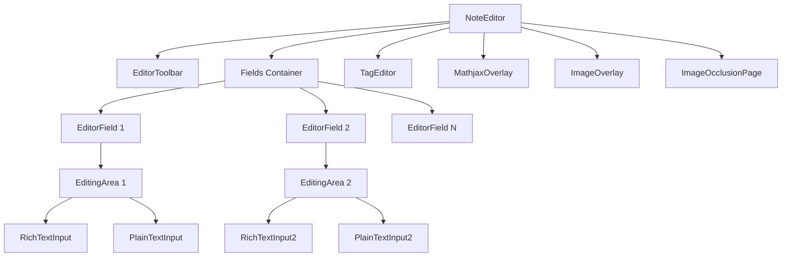

# Note Editor System

## Overview

The Note Editor system (`ts/editor/`) provides a comprehensive interface for creating and editing notes with rich text, plain text, and specialized features like image occlusion and MathJax.

**Main Component**: [`NoteEditor.svelte`](/home/felipe/Projects/anki/ts/editor/NoteEditor.svelte)  
**Directory**: [`ts/editor/`](/home/felipe/Projects/anki/ts/editor/)  
**Total Files**: 80 files

## Purpose

The editor system allows users to:
- Edit note fields with rich text or plain text
- Format text (bold, italic, underline, colors)
- Insert images, MathJax, and cloze deletions
- Manage tags
- Switch between rich text and plain text modes
- Use image occlusion editor
- Preview cards

## Architecture



## Main Components

### NoteEditor

**File**: [`NoteEditor.svelte`](/home/felipe/Projects/anki/ts/editor/NoteEditor.svelte)

Central editor component managing all fields and state.

**API Interface**:
```typescript
export interface NoteEditorAPI {
    fields: EditorFieldAPI[];
    hoveredField: Writable<EditorFieldAPI | null>;
    focusedField: Writable<EditorFieldAPI | null>;
    focusedInput: Writable<EditingInputAPI | null>;
    toolbar: EditorToolbarAPI;
}
```

**Key Features**:
- Field management (add, remove, reorder)
- State persistence (collapsed fields, input modes)
- Tag management
- Image occlusion integration
- MathJax integration
- Save/load functionality

**State Management**:
- `fieldStores: Writable<string>[]`: Field content stores
- `fieldsCollapsed: boolean[]`: Field collapse state
- `richTextsHidden: boolean[]`: Rich text visibility
- `plainTextsHidden: boolean[]`: Plain text visibility
- `tags: Writable<string[]>`: Tags store
- `tagsCollapsed: Writable<boolean>`: Tags collapse state

**Session Options**:
- Persists field states per note type
- Remembers collapsed fields
- Remembers input mode preferences

### EditorField

**File**: [`EditorField.svelte`](/home/felipe/Projects/anki/ts/editor/EditorField.svelte)

Individual field container.

**Props**:
- `content: Writable<string>`: Field content
- `field: FieldData`: Field metadata
- `collapsed: boolean`: Collapsed state
- `flipInputs: boolean`: Show plain text by default
- `dupe: boolean`: Duplicate indicator
- `index: number`: Field index

**FieldData Interface**:
```typescript
interface FieldData {
    name: string;
    fontFamily: string;
    fontSize: number;
    direction: "ltr" | "rtl";
    plainText: boolean;
    description: string;
    collapsed: boolean;
    hidden: boolean;
    isClozeField: boolean;
}
```

**Features**:
- Collapsible field container
- Field label with description
- Input mode switching
- Duplicate link indicator
- RTL support

### EditingArea

**File**: [`EditingArea.svelte`](/home/felipe/Projects/anki/ts/editor/EditingArea.svelte)

Container for rich text and plain text inputs.

**API Interface**:
```typescript
export interface EditingAreaAPI {
    refocus: () => void;
    element: Promise<HTMLElement>;
}
```

**Features**:
- Manages both input types
- Handles focus management
- Provides element reference

### RichTextInput

**Directory**: [`rich-text-input/`](/home/felipe/Projects/anki/ts/editor/rich-text-input/)

ContentEditable-based rich text editor.

**Features**:
- HTML editing
- Formatting commands
- Image insertion
- MathJax support
- Cloze deletion support

**Components**:
- Main input component
- Formatting helpers
- Content transformation

### PlainTextInput

**Directory**: [`plain-text-input/`](/home/felipe/Projects/anki/ts/editor/plain-text-input/)

CodeMirror-based plain text editor.

**Features**:
- Syntax highlighting
- Code editing features
- Undo/redo
- Auto-closing HTML tags

**Components**:
- CodeMirror integration
- Transform utilities
- Prohibited character removal

## Editor Toolbar

**Directory**: [`editor-toolbar/`](/home/felipe/Projects/anki/ts/editor/editor-toolbar/)

Formatting toolbar with buttons for text editing.

### Main Toolbar

**File**: [`EditorToolbar.svelte`](/home/felipe/Projects/anki/ts/editor/editor-toolbar/EditorToolbar.svelte)

**API Interface**:
```typescript
export interface EditorToolbarAPI {
    notetypeButtons: ToolbarSection;
    toolbar: ToolbarSection;
}
```

**Sections**:
- **Notetype Buttons**: Note type-specific buttons (slot)
- **Inline Buttons**: Bold, italic, underline, etc.
- **Block Buttons**: Lists, alignment, etc.
- **Template Buttons**: Cloze, fields, etc.
- **Options**: More options dropdown

### Toolbar Components

- **`InlineButtons.svelte`**: Inline formatting (bold, italic, underline)
- **`BlockButtons.svelte`**: Block formatting (lists, alignment)
- **`TemplateButtons.svelte`**: Template buttons (cloze, fields)
- **`NotetypeButtons.svelte`**: Note type buttons (slot)
- **`OptionsButton.svelte`**: Options dropdown
- **`ColorPicker.svelte`**: Color selection
- **`TextColorButton.svelte`**: Text color button
- **`HighlightColorButton.svelte`**: Highlight color button
- **`LatexButton.svelte`**: MathJax/LaTeX button
- **`ImageOcclusionButton.svelte`**: Image occlusion button
- **`RichTextClozeButtons.svelte`**: Cloze deletion buttons

## Overlays

### MathjaxOverlay

**Directory**: [`mathjax-overlay/`](/home/felipe/Projects/anki/ts/editor/mathjax-overlay/)

MathJax equation editor overlay.

**Components**:
- **`MathjaxOverlay.svelte`**: Overlay container
- **`MathjaxEditor.svelte`**: Equation editor
- **`MathjaxButtons.svelte`**: Math buttons

**Features**:
- Inline equation editing
- Block equation editing
- Preview
- Insert into field

### ImageOverlay

**Directory**: [`image-overlay/`](/home/felipe/Projects/anki/ts/editor/image-overlay/)

Image insertion and management overlay.

**Components**:
- **`ImageOverlay.svelte`**: Overlay container
- **`FloatButtons.svelte`**: Float control buttons
- **`SizeSelect.svelte`**: Size selection

**Features**:
- Image insertion
- Image resizing
- Float control (left/right/none)
- Size presets

## Specialized Editors

### BrowserEditor

**File**: [`BrowserEditor.svelte`](/home/felipe/Projects/anki/ts/editor/BrowserEditor.svelte)

Editor for browser context.

**Features**:
- Preview button
- Browser-specific UI

### ReviewerEditor

**File**: [`ReviewerEditor.svelte`](/home/felipe/Projects/anki/ts/editor/ReviewerEditor.svelte)

Editor for reviewer context.

**Features**:
- Reviewer-specific UI
- Simplified toolbar

## Field Management

### Field States

Fields can be in different states:
- **Collapsed**: Field is collapsed
- **Rich Text Hidden**: Rich text input hidden
- **Plain Text Hidden**: Plain text input hidden
- **Hidden**: Field completely hidden (image occlusion)

### Field Switching

Users can switch between input modes:
- Click badge to toggle
- Keyboard shortcuts
- Auto-switch on focus

### Field Persistence

Field states are persisted:
- Per note type
- Per session
- Includes collapse state and input mode

## Tag Editor Integration

**File**: [`TagEditor`](/home/felipe/Projects/anki/ts/lib/tag-editor/TagEditor.svelte) integration

Tags are managed via TagEditor component:
- Tag input with autocomplete
- Tag deletion
- Tag editing

## Image Occlusion Integration

When image occlusion note type is active:
- Image occlusion editor shown
- Image and occlusions fields hidden
- Mask editor integrated
- Tab switching between mask and note

## Save System

### Auto-Save

Fields auto-save on:
- Blur event
- 600ms debounce
- Page visibility change

### Manual Save

- `saveNow()`: Save immediately
- `saveOnPageHide()`: Save on page hide
- `saveSession()`: Save session state

## Context System

Editor uses Svelte context for:
- **NoteEditor context**: Editor API
- **EditorField context**: Field API
- **Direction context**: Text direction
- **Collapsed context**: Collapse state

## Package Registration

Editor components register as packages:
- `anki/NoteEditor`: Main editor
- `anki/EditorField`: Field component

Allows runtime access via `require()`.

## Key Files Reference

- **Main Editor**: [`NoteEditor.svelte`](/home/felipe/Projects/anki/ts/editor/NoteEditor.svelte)
- **Field Component**: [`EditorField.svelte`](/home/felipe/Projects/anki/ts/editor/EditorField.svelte)
- **Editing Area**: [`EditingArea.svelte`](/home/felipe/Projects/anki/ts/editor/EditingArea.svelte)
- **Rich Text**: [`rich-text-input/`](/home/felipe/Projects/anki/ts/editor/rich-text-input/)
- **Plain Text**: [`plain-text-input/`](/home/felipe/Projects/anki/ts/editor/plain-text-input/)
- **Toolbar**: [`editor-toolbar/EditorToolbar.svelte`](/home/felipe/Projects/anki/ts/editor/editor-toolbar/EditorToolbar.svelte)
- **MathJax**: [`mathjax-overlay/`](/home/felipe/Projects/anki/ts/editor/mathjax-overlay/)
- **Images**: [`image-overlay/`](/home/felipe/Projects/anki/ts/editor/image-overlay/)
