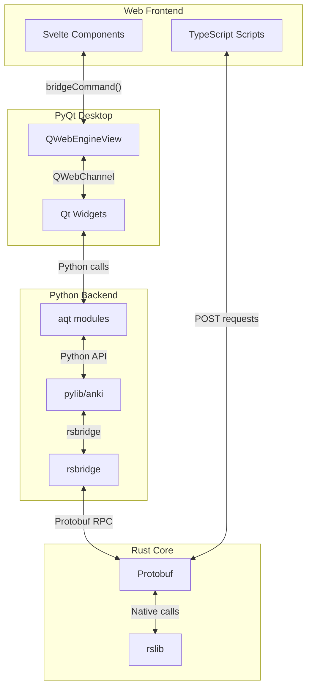
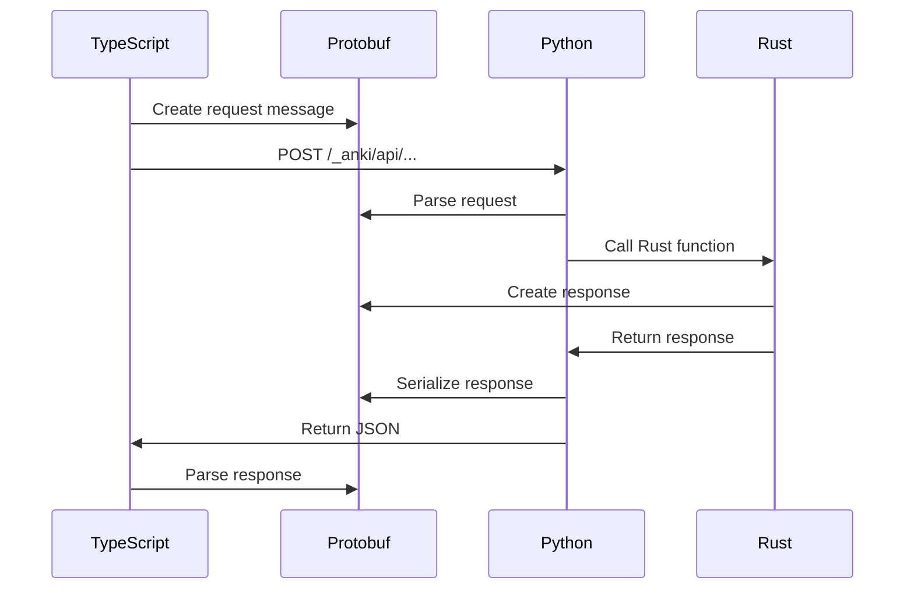

# Data Flows and Communication

## Overview

This document describes how data flows between the different layers of Anki's architecture: Svelte/TypeScript frontend, PyQt desktop UI, Python backend, and Rust core.

## Architecture Layers



## Communication Patterns

### JavaScript → Python

**Method**: `bridgeCommand()`

**Location**: [`tslib/bridgecommand.ts`](/home/felipe/Projects/anki/ts/lib/tslib/bridgecommand.ts)

**Pattern**:
```typescript
bridgeCommand(`command:${arg1}:${arg2}`);
```

**Python Handler**:
```python
def onBridgeCmd(self, cmd: str):
    # Parse command
    # Execute action
    # Return result
```

**Examples**:
- `saveTags:${JSON.stringify(tags)}`
- `focus:${index}`
- `key:${index}:${noteId}:${content}`

### Python → JavaScript

**Method**: `web.eval()` or `web.evalWithCallback()`

**Pattern**:
```python
self.web.eval("setupEditor('add')")
self.web.evalWithCallback(js_code, callback)
```

**Use Cases**:
- Initialize components
- Update UI state
- Execute JavaScript functions

### TypeScript → Rust Backend

**Method**: Protobuf RPC via POST requests

**Location**: `@generated/backend` module

**Pattern**:
```typescript
import { updateDeckConfigs } from "@generated/backend";

await updateDeckConfigs({
    targetDeckId: deckId,
    configs: configs,
    // ... other fields
});
```

**Flow**:
1. TypeScript calls generated function
2. Function creates protobuf message
3. POST request to backend
4. Python receives request
5. Python calls Rust via rsbridge
6. Rust processes request
7. Response sent back through chain

### Python → Rust Backend

**Method**: rsbridge module

**Location**: `pylib/rsbridge/`

**Pattern**:
```python
from anki._backend import RustBackend

backend = RustBackend()
result = backend.update_deck_configs(...)
```

**Flow**:
1. Python calls backend method
2. rsbridge converts to protobuf
3. Calls Rust function
4. Rust returns protobuf response
5. rsbridge converts to Python objects

## Protobuf Communication

### Definition Files

**Location**: [`proto/anki/`](/home/felipe/Projects/anki/proto/anki/)

**Key Files**:
- `deck_config.proto`: Deck configuration
- `stats.proto`: Statistics
- `import_export.proto`: Import/export
- `scheduler.proto`: Scheduling
- And 20+ more...

### Code Generation

Protobuf files generate code for:
- **Rust**: `rslib/proto_gen/`
- **Python**: `pylib/anki/` (via `_pb2.py` files)
- **TypeScript**: `ts/lib/generated/`

### Message Flow



## WebView Integration

### QWebChannel

**File**: [`qt/aqt/webview.py`](/home/felipe/Projects/anki/qt/aqt/webview.py)

QWebChannel provides bidirectional communication:
- JavaScript can call Python
- Python can call JavaScript
- Type-safe message passing

### Bridge Script

The bridge script injects `bridgeCommand()` into web pages:
```javascript
var bridgeCommand = function (arg, cb) {
    channel.objects.py.cmd(arg, resultCB);
}
```

## State Management

### Frontend State

- **Svelte Stores**: Reactive state management
- **Context**: Component communication
- **Session Storage**: Persist state

### Backend State

- **Collection**: Main database
- **Config**: User preferences
- **Session**: Current session state

## Error Handling

### Frontend Errors

- Display error pages
- Show error messages
- Log to console

### Backend Errors

- Return error responses
- Log errors
- Show user-friendly messages

## Key Files Reference

- **Bridge Command**: [`tslib/bridgecommand.ts`](/home/felipe/Projects/anki/ts/lib/tslib/bridgecommand.ts)
- **WebView**: [`qt/aqt/webview.py`](/home/felipe/Projects/anki/qt/aqt/webview.py)
- **Protobuf**: [`proto/anki/`](/home/felipe/Projects/anki/proto/anki/)
- **Backend**: [`pylib/rsbridge/`](/home/felipe/Projects/anki/pylib/rsbridge/)
- **Generated Backend**: `@generated/backend` (TypeScript)
